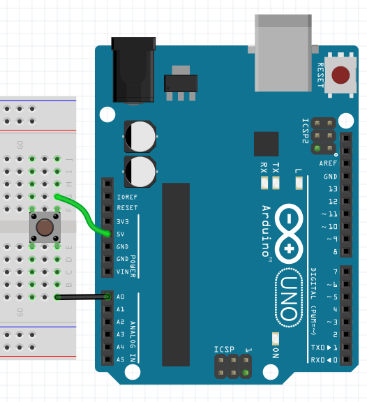
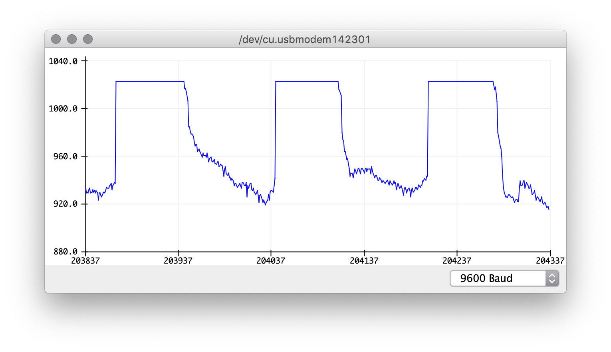
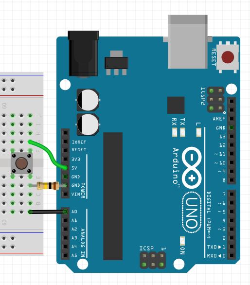
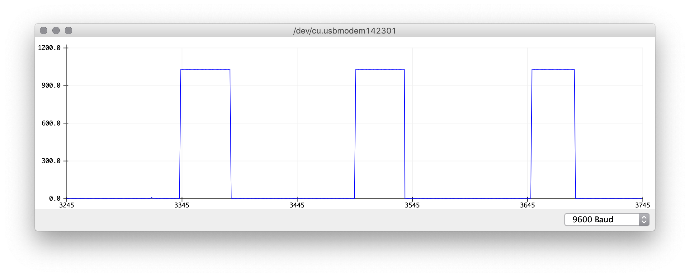
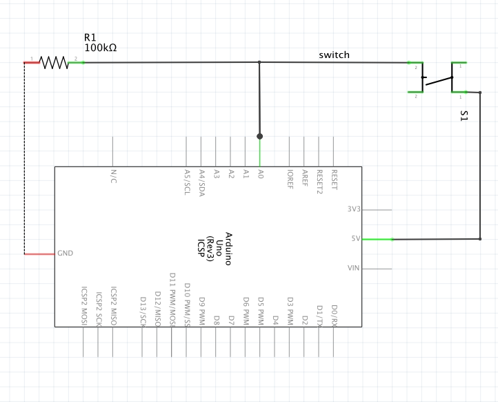
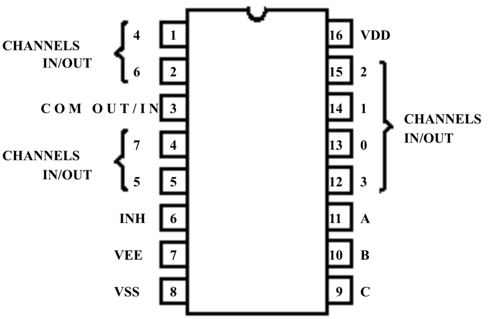
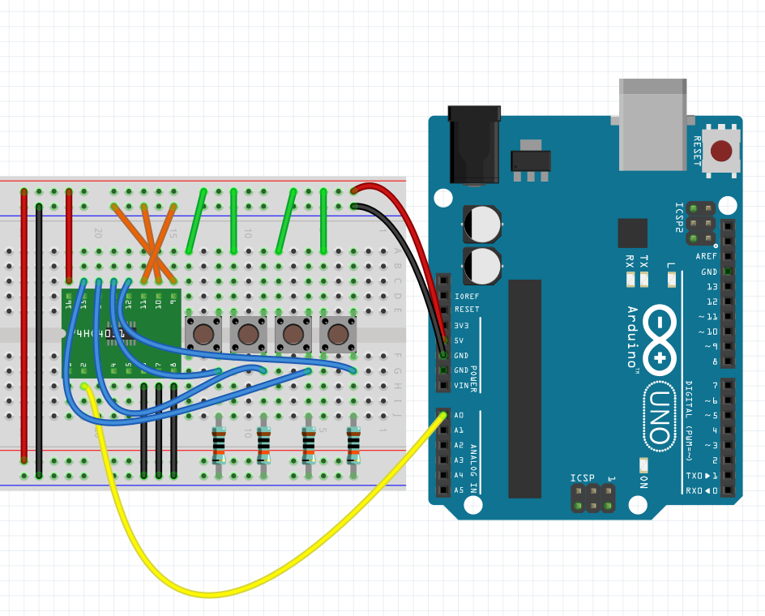

# Arduino Experiments

Here, I will try to approach the Arduino from the ground up, trying out various things.

## Analog Inputs

Let' start reading analog pin a0:

```c
void setup() {
  Serial.begin(9600);
}

void loop() {
  Serial.println(analogRead(A0));
}
```

After uploading, open the serial plotter.

### Connecting nothing at all

If the arduino is only connected via USB to the computer, no wires, the value will do crazy things and settle to a value around 250 but still flickering around much.

### Connecting a loose wire to A0

Now the plotter will flip out more janking around like crazy

### Connecting A0 to GND

When the wire goes from A0 directly to GND on the arduino, the value will set to 0, which is the minimum.

### Connecting A0 to 5V

Now the value will be at 1023, which is the maximum

### Afraid of a short circuit?

At first, it felt a little dangerous to that, but all the inputs are safe to connect up to 5V, so [no damage will be done](https://forum.arduino.cc/index.php?topic=422757.0).
But there are some [things to NOT do](https://www.rugged-circuits.com/10-ways-to-destroy-an-arduino).

## Connecting a switch to A0 and 5V

If we want to "read" the state of a flip switch (with two pins), we can connect one side to A0, and the other side to 5V:



If the flip is closed, the effect will be the same as connecting 5V directly to A0, yielding 1023.
But if the flip is open, this will be the same as having a loose wire, resulting in janky behaviour:



### pull down resistor to the rescue

To fix this problem, we can connect a strong resistor (100k) from A0 to GND:



The serial plotter now looks like that:



That's better! But why is this so? Let's look at a schematic view:



- If the switch is closed, the current will directly flow from 5v to A0
- If the switch is open, A0 will still be connected to GND, having a clean reference

If we did not use a resistor, 5V would be connected directly to GND, which will short circuit the arduino. 

So as a rule of thumb, you can think of the current taking the most convenient way..

## digitalRead

We can also use digitalRead for our button:

```c
void setup() {
  Serial.begin(9600);
}

void loop() {
  Serial.println(digitalRead(A0));
}
```

This will log 0 / 1 instead of 0-1023. I assume this will just look if the analog value is above or below 512..

## Connecting more Inputs

As the arduino is limited in its inputs, a good way to connect many more stuff to it is using a multiplexer (mux).

### CD4051



The cd4051 routes can route 1 out of max 8 inputs (CHANNELS IN/OUT 0-7 - blue) to its output (COM OUT/IN - yellow). 
The desired input can be selected with the select pins (ABC - orange). Additionally, VDD is connected to 5V and INH VEE and VSS to GND.



Using the button wiring from before, just 4 times, we can connect all of them to a single analog input.
In the image, the select pins (orange) are all set to ground (000), which selects input 0 (=first button).

If we set the select pins to 001 (move right cable from GND to 5V), we can select the 2nd button.
In the same manner the 3rd (010) and 4th (011) can be selected. 
The serial monitor will only log the selected buttons value while the others are ignored

### Looping through all inputs

The magic happens