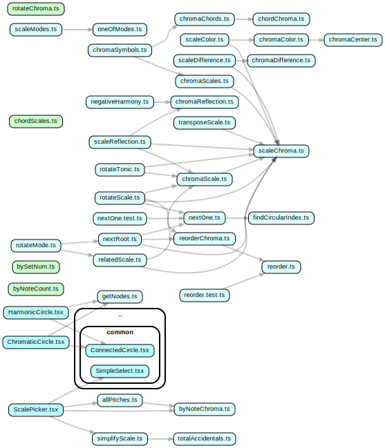

# Sets

## dependencies

run as npm script:

```sh
cd ./content/components/sets && dependency-cruise -x \"^(../../../node_modules|test)\" --output-type dot . | dot -T svg > deps-sets.svg && mv ./deps-sets.svg ../../../static/deps-sets.svg
```



## allPitches

import NestedGrid from '../../components/graphs/NestedGrid';
import allPitches from '../../components/sets/allPitches';

Those are all pitch class names in their simplest names with both sharps and flats:

<NestedGrid cells={allPitches} rows={[1, 1, 1, 1, 1, 1]} />
<br />

## byNoteChroma

Sort given pitch classes or notes by chroma.

```js
test('byNoteChroma', () => {
  expect(['D', 'Dbb', 'C', 'C#'].sort(byNoteChroma)).toEqual(['C', 'Dbb', 'C#', 'D']);
});
```

## byNoteCount

Sort given scales by note count:

```js
test('byNoteCount', () => {
  expect(Scale.get('dorian').intervals.length).toEqual(7);
  expect(['dorian', 'major pentatonic', 'major', 'minor pentatonic'].sort(byNoteCount)).toEqual([
    'major pentatonic',
    'minor pentatonic',
    'dorian',
    'major',
  ]);
});
```

## bySetNum

Sort given scales by set num:

```js
test('bySetNum', () => {
  expect(scaleModes('major').sort(bySetNum)).toEqual([
    'lydian',
    'major',
    'mixolydian',
    'dorian',
    'aeolian',
    'phrygian',
    'locrian',
  ]);
});
```

## chordChroma

import chordChroma from '../../components/sets/chordChroma';
import ConnectedCircle from '../../components/common/ConnectedCircle';
import { Note, Range } from '@tonaljs/tonal';

Get the chroma of the given chord:

<NestedGrid
  cells={[''].concat(Range.chromatic(['C3', 'B3']).map((n) => Note.get(n).pc))}
  rows={[1, 1, 1, 1, 1, 1, 1, 1, 1, 1, 1, 1, 1]}
/>

<div>
  {['C^7', 'C7', 'Cm7'].map((chord, i) => (
    <NestedGrid
      key={i}
      cells={[chord].concat(chordChroma(chord).split(''))}
      rows={[1, 1, 1, 1, 1, 1, 1, 1, 1, 1, 1, 1, 1]}
    />
  ))}
</div>
<br />

```js
chordChroma('C^7');
chordChroma('C7');
chordChroma('Cm7');
```

Also see [Pitch Class Sets > Chromas & Set Numbers](../../pitch-class-sets/#chromas--set-numbers)

## chordScales

find scales that are supersets of the given chord:

```js
expect(chordScales('m7', scaleModes('major'))).toEqual(['phrygian', 'aeolian', 'dorian']);
expect(chordScales('Dm7', scaleModes('major'), true)).toEqual(['D phrygian', 'D aeolian', 'D dorian']);
expect(chordScales('m7', ['minor', 'dorian', 'major'])).toEqual(['minor', 'dorian']);
expect(chordScales('^7', ['minor', 'dorian', 'major'])).toEqual(['major']);
```

## chromaCenter

Get the "center" of a given chroma:

TBD: write test that can be understood (current test is weird)

Also see [Coloring Scales](../../coloring-scales/)

## chromaChords

Get all chords that match the given chroma, based on the given tonic.

TBD: write tests
TBD: optional tonic to get all possible chords

## chromaColor

import chromaColor from '../../components/sets/chromaColor.ts';
import { Scale } from '@tonaljs/tonal';

export const circleOfFifths = Array.from({ length: 12 }, (_, i) => Note.get(Note.fromMidi(60 + ((i * 7) % 12))).pc);
export const scaleColor = (scale) => chromaColor(scaleChroma(scale));
export const familyScales = (family) => (
  <ul style={{ margin: 0 }}>
    {circleOfFifths.map((tonic) => (
      <li style={{ marginBottom: 2, listStyle: 'none', display: 'flex' }} key={tonic}>
        {Scale.modeNames(`${tonic} ${family}`).map(([root, scale], i) => (
          <span style={{ backgroundColor: scaleColor(`${root} ${scale}`), marginRight: 2, padding: 2 }} key={i}>
            {root} {scale}
          </span>
        ))}
      </li>
    ))}
  </ul>
);

<div>{familyScales('major')}</div>
<br />

```js
chromaColor(scaleChroma('C major')); // #BEBE2D
```

## chromaDifference

Calculates the "bit" difference of the two given chromas:

```js
test('chromaDifference', () => {
  expect(chromaDifference(scaleChroma('C major'), scaleChroma('F major'))).toBe(2);
  expect(chromaDifference(scaleChroma('C major'), scaleChroma('Bb major'))).toBe(4);
  expect(chromaDifference(scaleChroma('C major'), scaleChroma('Eb major'))).toBe(6);
  expect(chromaDifference(scaleChroma('C major'), scaleChroma('Ab major'))).toBe(8);
  expect(chromaDifference(scaleChroma('C major'), scaleChroma('Db major'))).toBe(10);
  expect(chromaDifference(scaleChroma('C major'), scaleChroma('Gb major'))).toBe(10);
  expect(chromaDifference(scaleChroma('C major'), scaleChroma('B major'))).toBe(10);
  expect(chromaDifference(scaleChroma('C major'), scaleChroma('E major'))).toBe(8);
  expect(chromaDifference(scaleChroma('C major'), scaleChroma('A major'))).toBe(6);
  expect(chromaDifference(scaleChroma('C major'), scaleChroma('D major'))).toBe(4);
  expect(chromaDifference(scaleChroma('C major'), scaleChroma('G major'))).toBe(2);
});
```

## chromaReflection

Reflects a chroma around the given axis (chroma index):

```js
test('chromaReflection', () => {
  expect(chromaReflection(scaleChroma('C major'))).toBe(scaleChroma('Ab major'));
  expect(chromaReflection(scaleChroma('Ab major'), Note.chroma('Ab'))).toBe(scaleChroma('E major'));
  expect(chromaReflection(scaleChroma('Ab major'), Note.chroma('Ab'))).toBe(scaleChroma('E major'));
  expect(chromaReflection(scaleChroma('E major'), Note.chroma('E'))).toBe(scaleChroma('C major'));
});
```

## chromaScale

Find scale name for given chroma, based on given tonic:

```js
test('chromaScale', () => {
  expect(chromaScale('101011010101', 'C')).toBe('C major');
  expect(chromaScale('101011010101', 'C', [])).toBe('');
  expect(chromaScale('101011010101', 'D')).toBe('D dorian');
  expect(chromaScale('101011010101', 'Eb')).toBe('');
  expect(chromaScale('101011010101', 'E')).toBe('E phrygian');
  expect(chromaScale(scaleChroma('C major'), 'D')).toBe('D dorian'); // see relatedScale
});
```

TBD: optionalize tonic to receive all possible scales
TBD: find out difference to chromaScales function

## chromaSymbols

receive all possible scales and chords for given chroma, based on given tonic

TBD: optional tonic

## ChromaticCircle

Displays a chromatic circle:

import ChromaticCircle from '../../components/sets/ChromaticCircle.tsx';

<ChromaticCircle
  tonic="C"
  pitches={['C', 'E', 'G']}
  sets={[{ stroke: 'steelblue', set: [0, 4, 7, 0] }]}
  label="C triad"
  r={80}
  nodeRadius={16}
/>

```js
<ChromaticCircle
  tonic="C"
  pitches={['C', 'E', 'G']}
  sets={[{ stroke: 'steelblue', set: [0, 4, 7, 0] }]}
  label="C triad"
  r={80}
  nodeRadius={16}
/>
```

## findCircularIndex

return first matching index, visiting all items in a circular fashion, starting from index offset:

```js
test('findCircularIndex', () => {
  const chroma = '101011010101'.split(''); // c major
  const isOne = (d) => d === '1';
  expect(findCircularIndex(chroma, isOne)).toBe(0);
  expect(findCircularIndex(chroma, isOne, 1)).toBe(2);
  expect(findCircularIndex(chroma, isOne, 3)).toBe(4);
  expect(findCircularIndex(chroma, isOne, 5)).toBe(5);
  expect(findCircularIndex(chroma, isOne, 6)).toBe(7);
  expect(findCircularIndex(chroma, isOne, 8)).toBe(9);
  expect(findCircularIndex(chroma, isOne, 10)).toBe(11);
});
```

dependency: pitch-class-sets > [rotateMode, rotateScale] > nextOne > findCircularIndex

## getNodes

returns nodes ChromaticCircle / HarmonicCircle.

TBD: test

## HarmonicCircle

Displays a harmonic circle:

import HarmonicCircle from '../../components/sets/HarmonicCircle.tsx';

<HarmonicCircle
  tonic="C"
  pitches={['C', 'E', 'G']}
  sets={[{ stroke: 'steelblue', set: [0, 4, 7, 0] }]}
  label="C triad"
  r={80}
  nodeRadius={16}
/>

```js
<HarmonicCircle
  tonic="C"
  pitches={['C', 'E', 'G']}
  sets={[{ stroke: 'steelblue', set: [0, 4, 7, 0] }]}
  label="C triad"
  r={80}
  nodeRadius={16}
/>
```

## negativeHarmony

flips around negative harmony axis:

```js
test('negativeHarmony', () => {
  expect(negativeHarmony(scaleChroma('C major'), 'C')).toBe(scaleChroma('C minor'));
  expect(negativeHarmony(chordChroma('C'), 'C')).toBe(chordChroma('Cm'));
  expect(negativeHarmony(chordChroma('Eb'), 'C')).toBe(chordChroma('Am')); // https://www.youtube.com/watch?v=x6zypc_LhnM
  expect(negativeHarmony(chordChroma('Eb6'), 'C')).toBe(chordChroma('Am7'));
  expect(negativeHarmony(chordChroma('C^7'), 'C')).toBe(chordChroma('Ab^7'));
  expect(negativeHarmony(chordChroma('F^7'), 'C')).toBe(chordChroma('Eb^7'));
  expect(negativeHarmony(chordChroma('F'), 'C')).toBe(chordChroma('Gm'));
  expect(negativeHarmony(chordChroma('Dm7'), 'C')).toBe(chordChroma('Gm7'));
  expect(negativeHarmony(chordChroma('G7'), 'C')).toBe(chordChroma('Dm7b5'));
  expect(negativeHarmony(scaleChroma('D major'), 'D')).toBe(scaleChroma('D minor'));
});
```

## nextOne

finds next "1" in the given chroma in a circular fashion, starting from the given index:

```js
test('nextOne', () => {
  expect(nextOne('101', 0)).toBe(2);
  expect(nextOne('101', 2)).toBe(0);
  expect(nextOne('10001', 4)).toBe(0);
  expect(nextOne('01001', 4)).toBe(1);
});
```

## nextRoot

Finds next note inside given scale, starting from given index

```js
test('nextRoot', () => {
  expect(nextRoot('C major', 1)).toBe('D');
  expect(nextRoot('C major', 5)).toBe('F');
  expect(nextRoot('C major', 7)).toBe('G');
  expect(nextRoot('C major', 1, 'D')).toBe('E');
  expect(nextRoot('A locrian #2', 7)).toBe('B');
});
```

## oneOfModes

scale filter function that keeps scales that are modes of the given scale families:

```js
expect(Scale.names().filter(oneOfModes(['major']))).toEqual([
  'lydian',
  'locrian',
  'phrygian',
  'aeolian',
  'dorian',
  'mixolydian',
  'major',
]);
```

## relatedScale

returns name of related scale of given scale, inside scale family:

```js
test('relatedScale', () => {
  expect(relatedScale('C major', 'D')).toBe('D dorian');
  expect(relatedScale('C major', 'Eb')).toBe('');
  expect(relatedScale('C major', 'G')).toBe('G mixolydian');
  expect(relatedScale('A locrian #2', 'B')).toBe('B altered');
});
```

## reorder

- reorder array items in a circular fashion.
- the subsequent indices of the returned item are "step" away in the given array
- items may be skipped or duplicated if items.length % step !== 1

```js
expect(reorder('ABCD'.split(''), 0).join('')).toBe('AAAA'); //
expect(reorder('ABCD'.split(''), 1).join('')).toBe('ABCD'); //
expect(reorder('ABCD'.split(''), 2).join('')).toBe('ACAC'); //
expect(reorder('ABCD'.split(''), 3).join('')).toBe('ADCB'); //
expect(reorder('ABCD'.split(''), 4).join('')).toBe('AAAA'); //
```

## reorderChroma

reorders chroma based on given steps (only 5 and 7 make sense):

```js
expect(reorderChroma('101011010101', 7)).toBe('111111000001'); // chromatic to fifths c major
expect(reorderChroma('111111000001', 7)).toBe('101011010101'); // fifths to chromatic c major
expect(reorderChroma('101011010101', 5)).toBe('110000011111'); // chromatic to fourths c major
expect(reorderChroma('110000011111', 5)).toBe('101011010101'); // fourths to chromatic c major
```

## rotateChroma

rotate ones so that the nth "1" is at the start:

```js
expect(rotateChroma(1, scaleChroma('C major'))).toBe(scaleChroma('C dorian'));
expect(rotateChroma(2, scaleChroma('C major'))).toBe(scaleChroma('C phrygian'));
expect(rotateChroma(3, scaleChroma('C major'))).toBe(scaleChroma('C lydian'));
expect(rotateChroma(4, scaleChroma('C major'))).toBe(scaleChroma('C mixolydian'));
expect(rotateChroma(5, scaleChroma('C major'))).toBe(scaleChroma('C aeolian'));
expect(rotateChroma(6, scaleChroma('C major'))).toBe(scaleChroma('C locrian'));
expect(rotateChroma(7, scaleChroma('C major'))).toBe(scaleChroma('C major'));
```

## rotateMode

Rotate mode / tonic n steps inside scale family:

```js
test('rotateMode', () => {
  expect(rotateMode('A locrian #2', 7)).toBe('B altered');
  expect(rotateMode('A locrian #2', 1)).toBe('B altered');
  expect(rotateMode('A major', 1)).toBe('B dorian');
  expect(rotateMode('A major', 7)).toBe('E mixolydian');
});
```

## rotateScale

Rotate scale inside scale family:

```js
test('rotateScale', () => {
  expect(rotateScale('C major', 1, scaleModes('major'))).toBe('C dorian');
  expect(rotateScale('C major', 7, scaleModes('major'))).toBe('C mixolydian');
  expect(rotateScale('C major', 5, scaleModes('major'))).toBe('C lydian');
  expect(rotateScale('C lydian', 5, scaleModes('major'))).toBe('C locrian');
  expect(rotateScale('G lydian', 5, scaleModes('major'))).toBe('G locrian');
});
```

## rotateTonic

TBD: depcreate / kill

## scaleChroma

import scaleChroma from '../../components/sets/scaleChroma';

Get the chroma of the given scale:

<NestedGrid
  cells={[''].concat(Range.chromatic(['C3', 'B3']).map((n) => Note.get(n).pc))}
  rows={[1, 1, 1, 1, 1, 1, 1, 1, 1, 1, 1, 1, 1]}
/>

<div>
  {['C major', 'C mixolydian', 'C minor'].map((scale, i) => (
    <NestedGrid
      key={i}
      cells={[scale].concat(scaleChroma(scale).split(''))}
      rows={[1, 1, 1, 1, 1, 1, 1, 1, 1, 1, 1, 1, 1]}
    />
  ))}
</div>
<br />

```js
scaleChroma('C major');
scaleChroma('C mixolydian');
scaleChroma('C minor');
```

## scaleColor

TBD: test

used in chordScaleGraph > chord-scales

## scaleDifference

TBD: test

## scaleModes

import scaleModes from '../../components/sets/scaleModes';

All modes of a given scale:

<NestedGrid cells={scaleModes('major')} rows={[1, 1, 1, 1, 1, 1, 1]} />
<br />

```js
scaleModes('major');
```

Also see [Pitch Class Sets > Modes](../../pitch-class-sets/#modes)

## ScalePicker

import ScalePicker from '../../components/sets/ScalePicker.tsx';

<ScalePicker scale={'C major'} onChange={(scale) => console.log(scale)} scales={scaleModes('major')} />

## scaleReflection

TBD: test

## simplifyScale

returns the scale name with the least accidentals:

```js
test('simplifyScale', () => {
  expect(simplifyScale('C dorian')).toBe('C dorian');
  expect(simplifyScale('Gb locrian')).toBe('F# locrian');
  expect(simplifyScale('Gb major')).toBe('Gb major');
  expect(simplifyScale('F# major')).toBe('F# major');
});
```

## totalAccidentals

returns sum of accidentals / note alterations:

```js
test('totalAccidentals', () => {
  expect(totalAccidentals(['C', 'D', 'E'])).toBe(0);
  expect(totalAccidentals(['C#', 'Db', 'F##'])).toBe(4);
});
```

## transposeScale

TBD: deprecate / kill > unused
