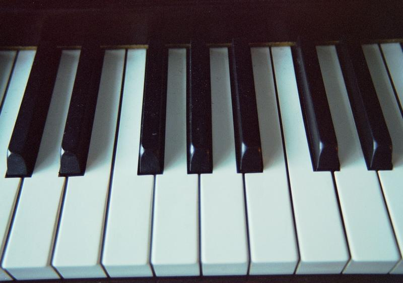

This has been scraped from http://www.garygarrett.me/?page_id=1922 just for my personal reading.

# Untempered Music

For almost two years now, I’ve been exploring the nature of music almost full-time. I threw out everything I knew, started with the most basic thing I could think of, the number 1, the origin of the musical universe, and worked my way from there.

My explorations quickly led to the underpinnings of musical harmony, the natural notes that can be expressed as ratios of small whole numbers. These are the notes people generally played and sang, before twelve-tone equal temperament (12ET) came along. 12ET is a clever tuning system, a collection of 12 notes that are slightly retuned from the natural ones, mathematically fudged so that you can play fixed-pitch instruments in any key, and change keys without retuning.

Before 2011, I’d never seriously questioned those 12 notes. They are “The Notes,” after all. They’re the ones on the piano, and they’re what your guitar tuner tunes to. They’re right, right? Well, not really. In the past two years, I have met and made friends with a whole color palette of new, untempered notes, no two alike, each with its own function and personality. In the process, I’ve discovered new ways of thinking about and visualizing music that have greatly increased my enjoyment of it. I have even made friends with equal temperament again, after a long journey away. This website will tell about the journey. Welcome!

Gary Garrett

## Flying Dream on YouTube

This may have been the most intense art project of my life. Some time early in 2012, I got it into my head to create a stop-motion animation of my song Flying Dream, moving in harmonic space. I’ve spent the past five months working like crazy on it. The song is carefully arranged using the lattice of fifths and thirds, sung and played in just intonation, and animated using colored lenses, rice paper and a flashlight.

If it doesn’t play smoothly, don’t hesitate to lower the resolution. It survives scaling well, and the timing is crucial.

<iframe width="560" height="315" src="https://www.youtube.com/embed/jA1C9VFqJKo" frameborder="0" allow="accelerometer; autoplay; encrypted-media; gyroscope; picture-in-picture" allowfullscreen></iframe>

This video encompasses almost everything I’ve learned in the past couple of years. I will be writing much more about it. Meanwhile, here are a couple of external links about the basic subjects:

[just intonation](http://en.wikipedia.org/wiki/Just_intonation)

[lattice (music)](<http://en.wikipedia.org/wiki/Lattice_(music)>)

## Back Story

Music is the thread that stitches my life together. I was born singing, as are we all. My parents loved to sing and they both had beautiful voices. They met in a musical play in college.

I remember our house as being filled with music, especially jazz and harmony vocals. Stan Kenton, the [Mills Brothers](http://www.youtube.com/watch?v=h-d4PlcAGb4&feature=related), Sons of the Pioneers, and all the big bands. [Sing Sing Sing at Carnegie Hall](http://www.youtube.com/watch?v=r2S1I_ien6A). Cool Water. All from the Curtis Mathes stereo, literally a piece of furniture, as big as a couple of dressers. I loved that sound, LPs coming out of that big resonant wood cabinet.

With my sister, we had four good voices, and singing harmony in the car was a highlight of growing up. My sister and I started writing songs together when we were kids.

I troubadoured randomly around the country with a guitar and the clothes on my back (hey kid, can you play that thing? hop in!), formed a rock’n’roll band, sang Christmas carols professionally, did singing telegrams in a chicken suit, and continued to write and record. I spent most of my “serious” career designing electronics for the remarkable [L.R. Baggs](http://www.lrbaggs.com/) Corporation in California. They make beautiful, innovative equipment for amplifying acoustic instruments.

I’ve become increasingly focused on music over the past five years or so. About two years ago, I began working full time on music and almost nothing else. Soon after, I had a huge epiphany, the best intellectual and spiritual experience I’ve ever had.

## Pythagoras’ Epiphany

Pythagoras was a Greek philosopher who lived about a century before Athens’ golden age. Some time before 530 BC, he had an [epiphany](<http://en.wikipedia.org/wiki/Epiphany_(feeling)>). He had been investigating vibrating strings, and found that when you cut the length of the string in half, the note it makes is an octave higher.

Sound is vibration. When one sound is vibrating twice as fast as another, it still sounds the same in some crucial way. The pitch is higher, or lower, but somehow we perceive it as having the same essential character. A C note, multiplied or divided by two as many times as you like, still sounds like a C.

Here are all eight C’s on the piano. They are different in pitch, but all have the same character. [Eight Cs](./Eight-Cs.mp3)

Pythagoras also found that when you shorten the string to a third of its original length, it vibrates three times as fast. The note this creates is different in character from the C. Today it is called a perfect fifth. If you’re in the key of C (that is, if the full string sounds a C), this note will be a G.

This observation led him to what must have been a terrific epiphany — math, particularly number, is at the heart of all things. I sometimes envy those early Greek thinkers — what joy, to come across something basic for the first time!

But you know, everyone, everywhere, has lived in modern times. A thousand years after Pythagoras, Galileo was the first to find out that the Milky Way is made of stars. Can you imagine how he felt? And we are still on the cutting edge — civilization is in its infancy. Future generations will envy us our discoveries while smiling at their primitiveness. “A keyboard, how quaint!”

<iframe width="560" height="315" src="https://www.youtube.com/embed/hShY6xZWVGE" frameborder="0" allow="accelerometer; autoplay; encrypted-media; gyroscope; picture-in-picture" allowfullscreen></iframe>

Pythagoras’ epiphany still has merit. Cosmologists have imagined many alternate universes, with different basic physical constants and laws, curved space, more dimensions — but it’s pretty tough to imagine a universe without number. I believe the integers — 1, 2, 3 and so on, are the most basic things we know about for sure.

Pythagoras actually founded a [religion](http://mathsisgoodforyou.com/topicsPages/pythagoreans/brotherhood.htm) based on this insight. The inner circle were called the mathematikoi, and they lived a monastic life of study. The order had many rules, including a ban on eating beans. Perhaps they worked in close quarters. They also had a rule against picking something up when you dropped it. Cluttered, close quarters! But they found out a lot about math.

## Beauty is Truth

It’s probably Keats’ most famous pair of lines:

[‘Beauty is truth, truth beauty,—that is all](http://www.bartleby.com/101/625.html)
[Ye know on earth, and all ye need to know.’](http://www.bartleby.com/101/625.html)

I believe he’s right on the money. I think that when we experience beauty, it’s because we have seen a little deeper into the nature of things.

This seems especially true of [mathematical beauty](http://www.cut-the-knot.org/manifesto/beauty.shtml). I had a college friend who found math exquisitely beautiful. He bought a blackboard for his room, and stayed up until all hours, glorying in the work. Elegance, simplicity ([but not too much!](http://quoteinvestigator.com/2011/05/13/einstein-simple/)), and beauty are important guidelines to the rightness of a solution or direction of research. A sense of beauty guides the scientist as well as the artist. I’m really familiar with this from my engineering career.

So there is the nugget of my own epiphany:

**The beauty of music is the beauty of mathematics, perceived in real time.**

We see this in its visual manifestations all the time. The [curve](http://en.wikipedia.org/wiki/Catenary) of the cables of the Golden Gate Bridge, the [pattern of seeds](http://www.sciencemag.org/news/2013/06/scienceshot-sunflowers-do-math) in the sunflower, the [rings of Saturn](http://apod.nasa.gov/apod/ap120916.html) — all clear manifestations of the way the universe works, that can be described by math, and that we find beautiful.

Music presents a pure, distilled form of this: beauty created by small, whole numbers and their relationships to each other.

## Notes and Intervals

A note, in music, is a sound with a particular pitch. Pitch is frequency, measured in cycles per second, or Hertz (Hz). The faster the vibration, the higher the pitch.

A vibration, at, say, 220 Hz, all by itself is a note by that general definition. But the note doesn’t acquire its distinct personality until it’s considered in relation to some other note. That relationship is called an interval.

Here is that 220 Hz note, played on a cello, all by itself: [220 Hz](./220-Hz.mp3)

Here it is in relation to a note an octave below, vibrating half as fast, at 110 Hz: [220 and 110](./Octave.mp3)

It still sounds like the same note. But now play it with a note vibrating at 1/3 of its frequency, or 73.33 Hz. The 220 Hz note acquires a very different character: [220 and 73](./Fifth.mp3)

And now with a note at 1/5 its frequency, 44 Hz: [220 and 44](./Third.mp3)

Even though the 220 Hz note always has the same pitch, in a different context it has a different personality and function.

The lattice of the Flying Dream video does not show absolute pitch. Each intersection, or node, represents a note, named according to its relationship to one special note: the Tonic.

## The Tonic

The heart of the lattice is the note called 1. This note is the tonic.

Almost all the music you hear — pop, rock, classical — has one note that is at the center, a master note against which all other notes are measured. That note is the tonic. It’s the _Do_ of Do Re Mi. When you call a scale “G Major,” or say that a song is in the key of G, the G is the tonic.

A single note means little by itself. But when it’s considered in relation to the tonic, it acquires meaning. The examples in yesterday’s post show how a note changes character when played against different tonics.

The tonic establishes the framework for the rest of the notes in a piece. It’s the anvil on which the music is forged.

The tonic can be any note. When you tune your guitar by the campfire, without a tuner, just tuning it to itself, you’ve chosen a reference frame that will make perfect sense, regardless of whether it’s the same frame as a piano or orchestra back home. You can happily play great music in the key of G-and-a-half, if you’re playing solo.

Once you’ve established the tonic, the rest of the notes are tuned, and named, relative to that note. The tonic is the center, the [Big Bang](http://en.wikipedia.org/wiki/Hubble_Extreme_Deep_Field) of that particular musical universe. The rest of the structure comes from the interplay between the tonic and small, whole numbers — mainly 2, 3, 5 and 7.

The tonic is Home. The lattice shows how music is a journey, away from home and back again, through different lands, each with its own scenery and feeling.

## Harmonic Experience

Over the next series of posts, I’m going to explain how the lattice in the [Flying Dream](https://www.youtube.com/watch?v=jA1C9VFqJKo&feature=emb_title) video works. Before I do, I want to take time to mention a terrific book.

I started investigating [just intonation](http://en.wikipedia.org/wiki/Just_intonation) in earnest in early 2011. A couple of months in, my friend [Kay Ashley](http://www.kayashley.com/) loaned me her copy of [Harmonic Experience](http://coldmountainmusic.com/harmonicexperience.html), by W. A. Mathieu. Thank you so much, Kay!

I spent a few weeks with Kay’s copy and very soon knew I had to have my own. I devoured the book almost daily for at least a year. I still pull it out often, lug it to a cafe for browsing over breakfast, do [bibliomancy](http://en.wikipedia.org/wiki/Bibliomancy) with it if I’m stuck creatively, take it on vacations.

Harmonic Experience is the only music theory book I’ve read so far that actually increases my understanding of music, rather than obfuscating it. It’s huge, which could be intimidating. But I found it to be immediately accessible and entertaining. Mathieu has a great, light sense of humor. The concepts are introduced at a beautiful pace. And the ideas he presents are enlightening. “Aha” experiences abound.

Much of what I’ll present in this blog is heavily influenced and inspired by Mathieu. [The lattice](<http://en.wikipedia.org/wiki/Lattice_(music)>) itself goes back to Euler in the 1700’s, but Mathieu expands on the idea enormously, arranging it so it corresponds to traditional musical staff notation, using it as a means to understand equal temperament, harmony, melody, chord progressions, world music, and much more.

Mathieu uses the term “positional analysis” to describe his system. For me, positional analysis opens the black box. It shows what’s happening in there. When my music is informed by the lattice, it makes more sense. I have more control over the effect it has on me and my audience. And it’s way more fun, because I know more about what I’m doing and why, rather than flailing around finding good sounds by instinct. And when I do compose by instinct (which is essential), I understand better why it sounds good, and can expand on my inspirations in a rewarding way.

‘Nuff said! If music theory has been frustrating for you in the past, as it has been for me, I can’t recommend this book highly enough.

## Between the Keys

I grew up thinking that music was made with a particular set of twelve notes, the ones on the piano keyboard. I had a vague sense that there were other scales in the world, but I thought of them as “more primitive” or perhaps subsets of the 12-tone scale, like that pseudo-Asian music you make if you play around on the black keys of the piano. I certainly didn’t know that those 12 notes, now so unconsciously established that hardly anyone in Western culture even questions them, are a relatively recent invention. In Europe, where they first caught on, they were fought bitterly for a century or so before they became the norm. Even now, much of the world still does not tune to these notes, although they are still spreading.

But I also grew up deeply aware of blues singers, and that notes sung “blue” could not be duplicated on the piano, or on the guitar without bending strings. Something was always different about rock, country and other blues-influenced music. All my favorite music had this quality in common — somehow richer in sound, with more heart, and it wasn’t just feel. And it wasn’t just blues either — almost all vocal harmony had “it” too, regardless of genre.

When I was a teenager, I heard a tiny phrase that hit me like [Sirius falling from the sky in the Truman Show](http://www.youtube.com/watch?v=8NTPpFNdca0). Here it is, fair use excerpt:

[The Note](./The-Note.mp3)

Hear it there, at the end? In the right channel, George Harrison plays something you absolutely cannot play on a piano, yet it is perfectly in tune. There is a wealth of information in that little phrase — it points to a whole world living there, in between the keys. That lick has stuck with me for all these years, a sign in the sky, that there was a lot more to know about music than I had been taught in textbooks.

## The Chord of Nature

When I first learned to play guitar, I would sit on the couch late at night and pluck the low E string, again and again, and just listen to the beauty of the sound as it died away.

That low E note is not just a simple vibration. The full length of the string is vibrating at about 82 Hz. But a pure 82 Hz note doesn’t sound like a guitar string at all. It sounds like this:

[82 sine](./82-sine.mp3)

The guitar sound is much more complex:

[guitar low e](./guitar-low-e.mp3)

The difference comes from the fact that a string doesn’t just vibrate along its whole length — it also vibrates at twice the frequency, three times, four, and so on — all at the same time!

Maybe you did this as a kid. I did. When you get a jump rope going, you are essentially vibrating a big string. It has a characteristic frequency, maybe two cycles per second, set by the length of the rope and the amount of tension, just like a guitar string. This frequency, the natural vibration speed of the whole string, is called the fundamental.

But if one person holds their end still, and the person on the other end moves the rope twice as fast as usual, a funny thing happens. The rope divides in two, and the center point stays still, while each half does its own circle. Again, the length and tension determine the natural speed. Go three times as fast, and three sections will appear. These higher-mode vibrations are called harmonics.

Here are a couple of guys in lab coats to demonstrate:

[Video](https://www.youtube.com/watch?v=-n1d1rycvj4)

This only works when you hit the right frequencies. Spin the rope at, say, 2 1/2 times the natural frequency and everything falls apart. The stable frequencies are the fundamental, 2x, 3x, 4x, 5x and so on. This video shows a string getting stable at 6x, 5x, 3x, and the chaos that happens in between.

[Video2](http://www.youtube.com/watch?v=no7ZPPqtZEg)

When you pluck a real string, it will vibrate in all these modes, generating a complex sound. The particular recipe of added harmonics creates the timbre, or tone, of the note.

Here’s that same pure 82 Hz tone, with the harmonics 2x, 3x, 4x and 5x added successively:

[Chord of Nature 2](./Chord-of-Nature-2.mp3)

This is the Chord of Nature. It is a sonic manifestation of number, and of the laws of the universe, and it’s very simple. If the fundamental frequency is 1, then the frequencies of the harmonics are 2, 3, 4, 5, 6 and so on. And somehow, our perception of sound is designed so that this sounds beautiful.

Here, in contrast, is the same demonstration but with the harmonics detuned randomly by less than two percent:

[Chord from Hell 2](./Chord-from-Hell-2.mp3)

Yipe! Now go back and listen to the first one as a palate cleanser.

There is something deep inside us that recognizes the series of harmonics, and, for most of us, labels it “beautiful.” There is some connection between those small, whole numbers and musical beauty.

## Notes As Ratios

Notes are pitched sounds. A given note means little by itself. It could be the tonic of a key, or some member of a scale based on a different tonic. By itself, it generates no tension, resolution or sense of place on the harmonic map.

So when I name a note in this blog, I’ll usually be referring to a ratio, the relationship between the note and a reference note — the tonic, or the root of a chord, or another note in the harmony or melody.

Ratios are fractions. The first number is divided by the second number to give the value of the ratio.

If the tonic is, say, 100 Hz, then another 100 Hz note is related to the tonic by the ratio 1/1. This is the interval of a unison, two identical notes.

Each note name on the lattice represents a unique ratio, relative to the tonic. The 1, at the center, stands for 1/1.

## Octave Reduction

Doubling the frequency of a note certainly changes it. The ear hears a higher-pitched note. But there is something in the essence of the note that does not change, a character that stays consistent through the octaves.

This allows a process called octave reduction. When you’re working with notes as ratios, it’s convenient to multiply or divide the raw ratio by 2, as many times as is necessary to bring it into the same octave as the tonic.

3/1 generates a perfect fifth. [3-1](./3-1.mp3)

This note is actually an octave plus a fifth above the tonic. Now divide by 2 and you have 3/2, one and a half times the original frequency, and just a fifth above. [3-2](./3-2.mp3)

The reference frequency is 1, the octave is 2, so what you want to achieve with octave reduction is a ratio, or fraction, between 1 and 2.

These are the beginnings of a scale, a collection of notes within a single octave. Such a scale can be repeated up and down the octaves to cover the whole range of hearing.

## The Major Third

Multiplying a note by 2 creates an octave, and multiplying it by 3 creates a perfect fifth.

Multiplying by 5 gives yet another new note, the pure major third. [5-1](./5-1.mp3)

5/1 is over two octaves above the original note, so you have to reduce it twice (divide by 4) to get it down into the same octave. [5-4](./5-4.mp3)

Now we have four notes: 1/1, 5/4, 3/2 and 2/1 — enough for a scale. [1-3-5-8](./1-3-5-8.mp3)

This scale is contained in the chord of nature, and it pops up all over the place. A clear example is the bugle.

Bugles have no valves or keys. So how can you play more than one note on one?

A bugle is a long tube full of air, curved so it fits in a small space. The player’s lips get the air column vibrating, and by changing the tightness of her lips, the player can coax the air column into vibrating along its whole length, or get it to break up into sections, just like the jump rope in the Chord of Nature demonstration.

Here are the bugle notes: [bugle scale](./bugle-scale1.mp3)

Two sidebars before I go on.

1. Isn’t it strange that when you multiply by 3 you get a fifth and when you multiply by 5 you get a third? The note names come from their position in a seven-tone scale. Here’s how our new scale fits with the standard do-re-mi. The notes we’ve explored are played louder to set them apart. [five notes in do re mi](./five-notes-in-do-re-mi.mp3)

The 5/4 note pops up third in the scale and the 3/2 note comes up fifth. It’s just a confusing coincidence, based on our fondness for seven-tone scales.

2. Here’s a sneak preview of why I’m going to all this trouble. The equal-tempered major third that we’ve been hearing all these years is not tuned to the 5/4 ratio. It’s tuned sharp, by almost 1%. This isn’t enough to make the note sound obviously sour, but it’s certainly enough to change the feel of it.

Try listening to the following example a few times, and pay attention to how you feel while listening. [JI3 vs ET3](./JI3-vs-ET3.mp3)

The first note you hear is the tonic with a pure major third. The second note is with an equal tempered major third. Then it goes back to the pure 5/4 note. The pitch difference is small, but I perceive an uneasiness, almost a queasiness about the equal-tempered version. Do you hear a difference, and if so, how does it feel to you?

## Harmonic Space

Now to relate all this to the lattice in the [video](http://www.garygarrett.me/?p=103).

Listening to music is like going on a journey. Most tonal music starts by establishing a center, or basic note, and a basic harmonic framework for the song, such as a major or minor mode. A few melody notes, and a beginning chord, and you have some idea of the space in which the journey will be occurring. Strauss’ Also Sprach Zarathustra (of 2001 fame) is a great example. The famous opening section, called “Sunrise,” gives an extremely clear sense of home. You know exactly where you are, sonically.

[Also Sprach Zarathustra](https://www.youtube.com/watch?v=SLuW-GBaJ8k)

By the way, it’s fun to hum this while using an electric toothbrush.

The piece goes on to travel away from this home, and back again, many times. The journey takes place in a space of some sort, an auditory environment.

But what might this space look like? One way to visualize music is staff notation:

It’s beautiful, and if I know how to read it, it will tell me what the music sounds like. It doesn’t do such a good job of showing me why music sounds the way it does. Neither staff notation, nor the 12-tone scale, gives me a particularly clear idea of how music works. Why would this be restful and sonorous:

[major](./major2.mp3)

While this, though beautiful in a different way, has tremendous tension? Sounds like the villain (or the cat) is about to pop out and scare you.

[aug](./aug.mp3)

Okay, okay, here’s the resolution: [major](./major2.mp3)

Aaahh.

If I know a lot about music theory, I can interpret the notation and come up with explanations. The second example is an augmented chord, and yes it sounds like that. But why, Mom, wh-wh-why?

## The Lattice

In 1739, the great mathematician Leonhard Euler published something he called a Tonnetz, German for “tone network.” It looked like this:

Euler’s Tonnetz organizes the notes into a matrix, instead of a scale. Moving down and to the left represents motion by an interval of a fifth (V) in musical space. Down and to the right shows movement by a major third (III).

The lattice has been rediscovered and redrawn many times over the years. One of my favorites is the Duodenarium of Alexander Ellis, which showed up in his appendix to Helmholtz’s pioneering book, On the Sensations of Tone, in the late 1800’s.

Now we’re talkin’! C is at the center. The fifths go up and down, and thirds from left to right, leading to a square grid.

One of W. A. Mathieu’s innovations in Harmonic Experience is to slant the axes and make them line up with the musical staff:

Seriously, if this blog interests you, please get a copy of this book. I have no stake in you doing this, except that I believe the more broadly understood this man’s work is, the more great music will be made.

I’ve been messing around with the lattice for a year and a half now, and I’ve morphed it into a form that suits my own musical work.

Further slanting the thirds axis to 60 degrees makes it a hexagonal lattice, and for me the relationships between the notes become more intuitive. The major chord is now, appropriately, a stable-looking triangle. And a new axis appears, northwest to southeast: movement by minor thirds. I follow Mathieu’s example and show this one with a dotted line, because it isn’t a direct move: the minor third is a third down and a fifth up, a compound move on the lattice — a major (sorry) insight into the nature of the minor third. Much more on that one later.

Japanese mathematician Shohé Tanaka drew a hexagonal tone lattice in the 1800’s. I haven’t been able to find a picture.

Movement to the right represents multiplication by 3, that is, up a fifth. Up and to the right means you’ve multiplied by 5, up a major third. Left means division by 3, down a fifth. Down left is division by 5, down a major third. The tonic, 1, is at the center (below left of center in this portion). The grid goes out to infinity. This is the region encompassed by Flying Dream, which in fact covers most of the territory I’ve found useful so far, a major reason I chose that song for the video.

## The Tonic Major Chord

The tonic is the center of the lattice. A drone note on the tonic establishes the center of that particular musical universe.

Adding a major third and a perfect fifth (5/4 and 3/2) further reinforces the center and starts to carve out some territory on the map.

This is the tonic major chord:

https://www.youtube.com/watch?v=OtyHYASRmS4

In my view, the tonic major helps the ear grab onto the center, by adding two notes that point directly at it. The ear has more information to work with.

The mind has amazing real time mathematical ability. Maybe a more accurate way to say this is that the mind has an amazing ability to quickly analyze and predict physical phenomena. The physical phenomena can be described by math. I don’t think the mind is working with arithmetic calculations at blinding speed, like a computer. It’s more of a massively parallel, holistic analog processor, that achieves a similar result.

Willie Mays used to catch fly balls with his back to the plate. Here’s a famous one:

https://www.youtube.com/watch?time_continue=15&v=7dK6zPbkFn

Mays watches the ball start its flight, calculates the [parabola](https://www.youtube.com/watch?v=EUqpyia45PM) it will follow (fine tuned by the conditions that day), and sets out at top speed for the spot, 400+ feet deep in center field, where he knows it’s going to land. He doesn’t (can’t!) look at the ball until it’s almost upon him. Marvelous.

So the ear hears a note, another one at 3x the frequency (remember octaves don’t count, 3/2 works like 3/1 in this regard), and another one at 5x. All three notes are direct signposts, pointing exactly at the tonic. Here we are, says the mind.

This may be why the equal-tempered major third gives me that slight queasy feeling. The tonic is the tonic, all right, but that equal-tempered third doesn’t point right at it! It’s close enough that the ear correctly identifies it, but it’s actually pointing at a note about 1% sharp of the tonic, and something sounds subtly off, like day-old sushi.

Here it is again: pure third, ET third, pure third. The middle note, the ET third, has a ratio of about 5.04/4.

[JI3 vs ET3](./JI3-vs-ET3.mp3)

Is it slight tonal vertigo? Where is home?

## Compound Notes

Multiplying the tonic by 2, 3 and 5 creates the octave, fifth and third respectively. The ear hears these intervals very well. We can easily sing them. Each one has a feel, a sort of harmonic flavor, that makes a fifth a fifth and a third a third.

It turns out that the ear can also easily hear compounds, that is, combinations of these low primes. Combining 2 with anything else simply puts it in another octave. But when you combine 3 and 5, or 3 and another 3, you get entirely new flavors. Here’s an example:

https://www.youtube.com/watch?v=Ve-u_spRpgk

The final note is an octave plus a major second above the tonic — a major ninth. Its ratio is (3/2) x (3/2), or 9/4. It has a haunting sound, to me, a different beauty certainly. A new crayon in the box.

## The Major Seventh

The notes get more exotic as you move outward from the center. The ninth is quite consonant, but not nearly as consonant as the fifth. ([Consonance and dissonance](http://en.wikipedia.org/wiki/Consonance_and_dissonance) are descriptions of feelings; they are part of the flavor of an interval, and I don’t think the last word has been written on them yet. I’ll be taking my shot later in these pages.)

For very small ratios such as 3/2, the ear has no trouble perceiving where it is on the map. The signal given by 3/2 is so strong, in fact, that it’s the primary tool used in classical music to move the ear to a new key center.

As the numbers get bigger, the signal gets weaker, and the interval gets more dissonant. To get to the major second, you multiply by 3 twice. Then, using octave reduction, you can put it in any octave you want. I chose 9:4 in yesterday’s example, giving an interval of a major ninth — an octave plus a major second.

Compounding a fifth and a third gives somewhat larger numbers (3×5 = 15, or a ratio of 15/8) and, sure enough, the note is more dissonant against the tonic. Yet it has its own unique beauty. Presenting the major seventh:

https://www.youtube.com/watch?v=eTkcQVc0-YU

Tomorrow, another kind of flavor entirely, another primary color in the crayon box, if you will.

## A Reciprocal Note: The Fourth

All the notes I’ve discussed so far are found above and to the right of the tonic, in the northeast quadrant of the map. These notes are generated by multiplication alone.

What about the notes that are generated by division? These are found to the left and down on the lattice.

The closer a note is to the tonic, the smaller the numbers are, and the easier it is for the ear to tell where it is. I’ll cover this much more in later posts, but I think the character of an individual note, its unique harmonic color, is largely determined by two signals it sends to the ear and mind:

1. How far away is home (the tonic)?

2. What direction is it?

And the closer the note is to home, the clearer the signal is.

The perfect fourth is the same distance from the center as the 5 is, but in the exact opposite direction: divide-by-3 instead of multiply-by-3. So it sends a signal of equal strength and opposite direction. How does this mirror-fifth sound?

https://www.youtube.com/watch?v=keW5xpdoL7g

I hear beauty, and tremendous tension. Something has to happen here, and soon — it feels like a pencil balancing on its point, [unstable equilibrium](http://nre509.wikidot.com/ball-well-diagrams-feedback-and-equilibria).

Here are two of the most powerful phenomena in music: tension and resolution.

One resolution is right next door: the major third. It’s only a half step lower, and it is a point of [stable equilibrium.](http://nre509.wikidot.com/ball-well-diagrams-feedback-and-equilibria)

https://www.youtube.com/watch?v=c5crmXL8wkI

Aaaaahhhh.

There’s another way to resolve the tension, and that is to move the playing field so that the fourth is in a stable spot. This is done by changing the root. It’s a chord change. Check this out:

https://www.youtube.com/watch?v=sxyQcvIHVmk

[The mountain has come to Muhammad](http://www.phrases.org.uk/meanings/if-the-mountain-will-not-come-to-muhammad.html).

The ratio of the perfect fourth is 1/3. This can be octave-reduced (octave-expanded) by moving it up two octaves, to 4/3.

The energy of the fourth, the division energy, has had a number of names. Harry Partch, a major composer and explorer of music in just intonation, called the quality of the right-and-up harmonies (the ones you get to by multiplication) otonality, from overtone. He called the energy of division-based harmony utonality, for undertone.

Once again I’m going with Mathieu on this one. In Harmonic Experience, he gives an excellent rationale for calling this energy reciprocal. I think he’s right. Each overtonal note has its mirror twin, and the twins are identical, just upside down from each other — reciprocals. The fourth is the reciprocal of the fifth.

## Mixed Messages

The harmonic lattice can be divided into four quadrants.

Northeast is pure overtonal energy. All these notes are reached by multiplication alone. Powers of 3 and 5 are in the numerators, and the denominators are all powers of 2.

Southwest is pure reciprocal energy. You get there by dividing. All the 3’s and 5’s are on the bottom of the ratio (or fraction), and the powers of 2 are on the top.

Northwest is mixed reciprocal and overtonal energy. You multiply by fives and divide by threes.

Southeast is also mixed. Multiply by threes and divide by fives.

The major sixth is in the northwest quadrant. First divide the tonic by 3, which gives you a perfect fourth. Then multiply that by 5, and you get the major sixth. Its ratio is 5/3. You can do this in any order, of course — multiplying by 5 gets you to the major third, and dividing by 3 brings you to the sixth again.

https://www.youtube.com/watch?v=91yqf2yjWDY&feature=emb_title

A different flavor yet! What do you hear? How does it make you feel?

Musical sensation can be related to other senses and emotions, but really these feelings have their own quality. It’s like a new sense. I had a friend once who had never tasted a peach. She didn’t like the feel of the skin, and she hadn’t dared bite into one. I was saddened, of course, but how to describe the taste of a ripe peach to someone who’s never tasted one? You can draw comparisons forever, but nothing will prepare them for the reality.

That was a long time ago. I hope that some time later, she found herself in the [perfect place](https://www.wsj.com/articles/SB10001424052970203946904574300192082040918) and went for it. There should be a First Peach ceremony. Yum!

The individual qualities of these notes are easier for me to hear in just intonation than in equal temperament. They are purer flavors, a more direct experience. Later, I’ll present some notes that are very close together in pitch, yet feel different. In just intonation, there are different notes for peach, nectarine and apricot. In equal temperament, a single note, close in pitch, will represent all three. Once you’ve tasted the actual fruits, equal temperament works better than it did before. You know what it is you’re supposed to be tasting.

OK, I’m out on a quivering limb of analogy now, and way ahead of my story. We have enough notes now to start playing with them.

## Names

Musical nomenclature has been cobbled together over the centuries like a [medieval city](https://boardgamegeek.com/boardgame/822/carcassonne). Different systems leave their imprint in convention, later developments try to be compatible with accepted names, and the whole thing ends up confusing and contradictory.

Take enharmonic equivalents, for example. G# and Ab are the same note on the piano, the black key between G and A. So why do you sometimes call that note by one name, and sometimes by the other? The answer actually leads to some deep realizations about music, and it comes back to just intonation. In untempered or just music, G# and Ab are not the same note, and which one you choose becomes important. It’s important in [ET](http://en.wikipedia.org/wiki/Equal_temperament) too — the music establishes a context, and the ear figures out which note it’s supposed to be. But if you grew up with ET, and have no idea that there used to be two different notes there, the names can be confusing. How do you imply one note or the other? Which one is right in a given situation? Why bother? It’s a huge part of writing chord progressions that make sense, but ET by itself isn’t going to tell you what to do. You have to dig deeper for that.

I’ve slowly evolved a personal system I’m very happy with. It’s based on the lattice.

The great advantage of this approach is that it’s entirely unambiguous. Every note on the infinite lattice has a unique name, and that name tells you exactly what its pitch is, and where it is on the map.

The seven notes I’ve covered so far form the core of the system. I’ve dropped all the word names and just use numbers:

**1** — the tonic, 1/1

**2** — the major second, 9/8

**3** — the major third, 5/4

**4** — the perfect fourth, 4/3

**5** — the perfect fifth, 3/2

**6** — the major sixth, 5/3

**7** — the major seventh, 15/8

The rest of the notes are named by adding accidentals to modify the pitches. I’ll quantify these later, and explain how they work, but approximately they are:

**b** — flat by about 2/3 of an equal-tempered semitone

**#** — sharp by about 2/3 of a semitone

**–** — flat by about 1/5 of a semitone

**+** — sharp by 1/5 semitone

**7** — flat by 1/2 semitone.

The basic notes occupy the center of the lattice. These seven notes form the major scale.

## The Major Scale

The notes 1, 2, 3, 4, 5, 6 and 7, clustered at the center of the lattice, constitute a major scale. This tuning uses the smallest ratios (the ones with the lowest numbers) available for each position in the scale. It goes back at least to Ptolemy in the 100’s AD.

https://www.youtube.com/watch?v=uDYiNd7NXuM

I find it visually beautiful. It’s like a cat’s cradle.

Here it is again, with a drone on the tonic, to show how the notes resonate with the drone. Each one has its own flavor, its own harmonic character.

https://www.youtube.com/watch?v=ZT8xtE-LWYY

Notice how the melody never moves from a note to the note next door. It always moves two grid segments. This is a first look at the difference between harmonic space and melodic space.

Melodies “like” to move up and down on a linear scale. They want to go to a nearby note when they move — that is, near by in pitch. We hear, and sing, small movements in pitch better than we hear leaps.

Harmonies “like” to go to nearby notes too, but harmonic space is different than linear, melodic space. The 1 and the 5 are harmonic neighbors. In fact, they are as close together as notes can be, harmonically, without being the same note — a single factor of three. But they are far apart melodically — the 5 is almost at the midpoint of the scale.

1 and 2 are melodic neighbors, It’s easy to for the voice to move from one to the other. But they are far apart harmonically — two factors of three. A small move in pitch can produce a large harmonic jump.

Arranging a melody and chord progression involves interweaving the notes so they work in both spaces. The melody will tend to move up and down by small melodic steps, close together on the scale. The chords will tend to move by small harmonic steps, close together on the lattice.

It’s a bit like designing a crossword puzzle, working “up” against “down” until it all fits. The lattice is a wonderful tool for visualizing this dance.

## Reciprocal Thirds

There are four basic moves available on the lattice of fifths and thirds. They are:

Up a fifth (x3)

Down a fifth (÷3)

Up a major third (x5)

Down a major third (÷5)

Each of these moves has its own harmonic flavor, and they can be combined to create new flavors.

The major scale only uses the first three building blocks. What about the fourth one?

The land of reciprocal thirds is where most of the black keys reside. It’s the world of minor tonality. Here is the sound of a pure reciprocal third:

https://www.youtube.com/watch?v=qWyp-5VpDAc&feature=emb_title

The new note is a mirror of the 3, an upside-down 3. Its ratio is 1/5, which can be octave-shifted to 8/5. That ratio puts it a little over halfway up the scale, between the 5 and the 6. It’s called the minor sixth or flatted sixth; I use the symbol b6.

There is a beautiful shift of feeling when you move from overtonal energy to reciprocal and back again. To me it feels like breathing in and out. Maybe that’s because I play harmonica. When you blow on a few holes of a Marine Band, you get the 1 chord. When you draw, you get the 4. Breathing in and out takes you back and forth between reciprocal and overtonal territory.

https://www.youtube.com/watch?v=JYqSf2H7lrA&feature=emb_title

The same action can happen on the 5-axis, with a more exotic flavor:

https://www.youtube.com/watch?v=t3o8ZFlXBJc&feature=emb_title

Hear the shift? Overtonal, reciprocal, back again. Every note on the lattice except the 1 has its mirror twin.

## The Minor Third

Here’s an interesting and perhaps misunderstood note.

It’s a compound move on the lattice: down a third and up a fifth. Or up a fifth and down a third, it doesn’t matter what order. So the ratio is 3/5, or 6/5, octave reduced. The note is the minor third. I call it b3.

https://www.youtube.com/watch?v=PcJkrg0ChFw&feature=emb_title

It lives a little bit flat of the major third — much less than an equal-tempered half step.

The closeness of major and minor, the small size of this particular half step, is one of the revelations I’ve had in the past couple of years. Major and minor are only about 2/3 of a semitone apart.

The difference between major and minor third is not so much one of pitch, but of polarity. The minor third contains reciprocal third energy and the major is overtonal third energy. [A smile is just a frown turned upside down](http://www.youtube.com/watch?v=sV69WBvFGBA) … Here’s an example that shows the reversal in polarity between major and minor third. This is untempered tuning. The pitch is moving by less than a piano key while dramatically shifting the harmonic ground.

https://www.youtube.com/watch?v=VvWifTiHHZ4&feature=emb_title

I hear that same sort of “breathing” as in yesterday’s post — in, out, in, out.

I say “misunderstood,” because equal temperament changes the character of this note. Mathieu has a nice passage in Harmonic Experience:

_When I first found my own voice inside a minor triad, I couldn’t believe it was so — well, so (arggh! I can scarcely say the dreaded word, but here goes) — so … happy. There. We are told from the beginning that minor is sad, the designated mode for angst and funerals. Well, to be honest, the equal-tempered version of the minor third is rather sad. [It] is too narrow, or flat. So piano minor is flat and sounds dull — the fire is out of it. But minor thirds in just intonation, and the minor triads they support, are swift and burning. They have the gypsy left in them, and do some leaping kind of dance._

– W.A. Mathieu, Harmonic Experience, p. 55

The gypsy really comes out to dance when it’s actual music, but to get an idea, here’s that same seesaw between minor and major. This time it’s tuned to equal temperament.

https://www.youtube.com/watch?v=Z_neo1zIAK0&feature=emb_title

Is it my imagination, or do I hear a little melodrama here? Is the minor overly sad, the major a little over-the-top happy?

## The Minor Seventh

The farther we get from the center, the less consonant the notes are, when played against the tonic. Consonance is a whole subject. It’s generally spoken of as though it could be plotted on a scale, from consonance to dissonance. I think this is a big mistake. Consonance has more than one dimension. Trying to force these independent dimensions of consonance onto a one-dimensional scale leads to unnecessary confusion.

Anywayy … The minor seventh is a pretty dissonant note in all dimensions. It’s three moves away from the tonic, down a third and up two fifths:

https://www.youtube.com/watch?v=dhDDhddfsD0&feature=emb_title

The ratio is 9/5.

This is some beautiful, exotic harmony.

Here’s a progression that shows off the flavor of the b7, in just intonation:

https://www.youtube.com/watch?v=sqTnOLV7y0g&feature=emb_title

Hey, that’s beautiful! I worked it out as an illustration, with the idea of showcasing the minor seventh, and it turned out to be really nice music.

See why I’m in love with the lattice? It’s a beauty engine.

## Untempered Vs. Tempered

I’ve been listening to yesterday’s chord progression showing off the b7.

I think it offers an excellent opportunity to hear the difference between equal temperament and just intonation.

Equal temperament works by implying or evoking a note rather than playing it exactly. There are dozens of singable notes per octave; ET represents them all with just twelve tones.

Some ET notes are close to their just counterparts; the 4 and 5 are close enough to be essentially right on. The major third is not so great. It’s 0.8% sharp, enough to change the feeling it produces.

The ET b7 is even further off, a full 1% flat of the untempered note. For me, this is enough to change its flavor entirely, and dilute its resonance to the point where it’s just not the same note. I would contend that the real experience of the b7 is not actually available in equal temperament.

Here it is again:

https://www.youtube.com/watch?v=sqTnOLV7y0g&feature=emb_title

And in ET:

https://www.youtube.com/watch?v=qy_BPaqRuL0&feature=emb_title

To me, the real b7 sounds triumphant, like its arms are outstretched to the sky after a great victory.

The ET one sounds very different. It’s not unpleasant, but it sure is different. It it a little sad? The leaping dance is gone. The b3 is flat too. Poor minor, no wonder she’s sad! A mortal has [seized the hem of her garment](http://www.sacred-texts.com/neu/ftmg/ftmg03.htm) and made her earthbound, in order to put her in his power and make her a little better behaved.

Now go back and listen to the JI version. My experience is that I hear it a little sharp for a second, and then it settles in and wow. This is all subjective; you may hear entirely different things. But this example makes it pretty clear, I think, that JI and ET do not sound the same.

So here we have a note, with a distinct (and unique) personality, that produces a physiological sensation that just isn’t quite available in equal temperament. There are a lot more of these to come, with strange and beautiful colors. Really getting into JI and the lattice is like getting the [64-color Crayola box](http://en.wikipedia.org/wiki/List_of_Crayola_crayon_colors) for Christmas. Orange-yellow and yellow-orange, what riches!

One of my favorite phrases in any song comes from the great [Greg Brown](http://www.gregbrown.org/). In [Eugene](http://www.lyricstime.com/greg-brown-eugene-lyrics.html), from [The Evening Call](http://www.redhouserecords.com/198.html), he says,

_The Northwest is good, once you get off I-5 and wander up and down the Willamette dammit, on the back back roads. I know a few people who’d let me park in their drive, plug in for a night or two, stay up late, and talk about these crazy times — the blandification of our whole situation. And then back to the woods. A dog is bound to find me sooner or later. Sometimes you gotta not look too hard — just let the dog find you._

The blandification of our whole situation. Nice one, Mr. Brown. I recommend going back and forth between the last two vids a few times. Deblandification!

By the way, [The Evening Call](http://www.gregbrown.org/gblyricsevening.html) is packed with great lyrics and music. Top notch.

## The Minor Second

The last three notes (b6, b3 and b7) are related to each other. They all contain a reciprocal third. There is a family resemblance of sound and function. (They also all happen to be a little flat in equal temperament. On a guitar it’s a nice trick to bend them a little to sweeten them.)

Here is another note in the family, farther out harmonically, the minor second:

https://www.youtube.com/watch?v=c8GPcR6p6DQ&feature=emb_title

That’s a dissonant interval. The b6 is already tense with reciprocal third energy. Now this b2- (The minus is an accidental to show its exact pitch; more later) is another reciprocal fifth beyond (below?) that note. Its ratio is 1/15, which expands to 16/15 — just above 1. See how the ratios show where the pitch of the note is? 1/1 is the tonic, 2/1 is the octave. 16/15 is just a little bit greater than 1, so it’s just a little sharper than the tonic.

It’s not pitch so much that makes consonance and dissonance. It’s harmonic relationship.

Music is all about tension and resolution. Here’s a very tense note. How to resolve it?

One answer is just a half step away, a drop to the tonic.

https://www.youtube.com/watch?v=ya9S3gR-OKg&feature=emb_title

That’s a move in melodic space. The tonic is right next door and it’s an easy drop.

On the lattice, the 1 is not a next door neighbor. How about going home through harmonic space instead?

https://www.youtube.com/watch?v=yQFkEPQEeqs&feature=emb_title

Going to the 4 is an interesting experience for me. There’s still reciprocal tension, but I’m much closer to home — I can smell the stables. It’s as though I felt a bit lost at the b2-, the harmonic distance was too great to really get my bearings. But moving to the 4 allows me to figure out where I am, and where the tonic is, so that the final move home sounds really right. The 4 says to me, “There is home, now go.”

Then the melody moves to the 5, and there is resolution. The 5 sends just as strong a signal as the 4, but of opposite polarity. The 5 says, “Here is home. Now stay.”

It’s a little story, a journey on a microcosmic landscape of attraction, repulsion and beauty.

## The Augmented Fourth

I’ve described eleven notes now, and each one has a piano key to go with it, an equal tempered equivalent.

The one remaining black key has a lot of names. It’s the note between the 4 and 5, right in the middle of the octave — the tritone, devil’s interval, flatted fifth, augmented fourth.

In ET there’s only one tritone, and it precisely splits the octave in half. In JI, there are several tritones, with different tunings, that sound and function differently from each other.

One tritone, that nicely fills out the set of 12 notes, is the [augmented fourth](http://www.guardian.co.uk/notesandqueries/query/0,,-1767,00.html):

https://www.youtube.com/watch?v=czSq2LpOYzw&feature=emb_title

This note is not like the other black keys. It’s completely overtonal, that is, it is generated entirely by multiplication — x3, x3, x5, or 45/1. It does appear in the Chord of Nature, but so far up that it wouldn’t be audible in the harmonics of a vibrating string. I think the fact that we can hear any harmony at all with this note shows that we can hear compounds of simple ratios, even when the numbers are getting pretty big. If pure ratios were all that mattered, 13/1 would be far more harmonious than 45/1 — the numbers are smaller. But 13/1 is almost nonexistent in the musics of the world, and even 11/1 is very rare.

So the harmonic connection with the tonic is tenuous, but it’s there. I hear a different kind of dissonance than the b6 or b2-, more harmonically distant, but without as much of that urgency-to-move that the reciprocal notes have.

It’s natural to resolve it melodically to the 5:

https://www.youtube.com/watch?v=kbQ_IFVdge4&feature=emb_title

Or once again we can travel through harmonic space to get back home.

https://www.youtube.com/watch?v=yScfxlxz3QU&feature=emb_title

Can you hear yourself getting closer to home with each step?

We now have a set of 12 notes, one for each key of the keyboard. Next, the prime number 7, and then some notes between the keys. [Oh, the places we’ll go!](http://www.youtube.com/watch?v=ahv_1IS7SiE)

## Prime Numbers and the Big Bang

Every prime number generates a new musical universe.

Prime numbers are numbers, greater than one, that can only be evenly divided by themselves and 1. All other numbers are composite — that is, they can be made by multiplying two or more primes.

1. Multiplying by 1 does nothing. 1 is a singularity, the [universe](http://www.youtube.com/watch?v=08LBltePDZw) before the big bang, the anvil upon which the music is forged.

2. Two starts off the explosion. Multiplying by two creates a universe of octaves, an endless, sterile line of equally spaced mile markers on the road to harmony.

Reminds me of the [first chapter of Genesis](http://www.biblegateway.com/passage/?search=Genesis+1&version=NIV), where everything is formless until the Creator starts differentiating stuff, day from night, water from sky, land from water, animals from plants, and people from animals. Start multiplying by two and before you know it you have a universe!

I’m also reminded of the current theory as to how our own universe came to be. Here’s a nice summary I found on a [physics message board](http://www.physlink.com/education/askexperts/ae649.cfm). It’s by Joel Novicio, an undergraduate physics student at the time.

_The Big Bang singularity is a point of zero volume, but very high mass, which makes the density infinite. This singularity contained all of the matter and energy in the Universe. The initial moment of the [cyclopean explosion](http://www.thefreedictionary.com/cyclopean) very well remains a mystery — however, astronomers and physicists believe that after the tiniest fraction of a second, the strong nuclear force and the electromagnetic force separated, which probably caused the Universe to begin inflating. The Big Bang itself created space, time, and all of the matter and energy we know today._

OK, maybe I’m getting a little bit [woo-woo](http://www.urbandictionary.com/define.php?term=woo%20woo) here, but really I don’t think this is a trivial or accidental connection. The musical universe arises from the numbers. So does the physical one, at its deepest levels. I think that’s why we perceive music as beautiful.

I _am_ stretching it now, but guess what is thought to have [happened next](http://en.wikipedia.org/wiki/Chronology_of_the_universe) after the splitting of the forces? Quarks! [Quarks](http://www.particleadventure.org/quarks.html) are the building blocks of protons and neutrons, almost all the matter we’re familiar with. And they come in threes.

3. Three makes it interesting. Keep multiplying and dividing by 3 and you can get an equivalent for every key on the keyboard, and many more. The notes never repeat, as you multiply and divide, so this universe is infinite as well.

This is the central spine of the lattice. The crucial notes 4 (perfect fourth, 4/3) and 5 (perfect fifth, 3/2) are multiples of 3. They are the backbone of music, and in my opinion, the fact that these are almost exactly in tune in equal temperament is a big reason why ET has been able to be so successful. If the 4 and the 5 were as far out of tune as the major third is, I don’t think ET could ever have been adopted.

Pythagoras based his musical scale entirely on 3 and 2. His followers expanded this, compounding it many times into what is now called Pythagorean tuning.

The first few notes generated by this tuning are beautiful. The 5 (x3) and 4 (÷3) are perfect consonances. The 2 (3×3) is really sweet. I personally like the Pythagorean sixth (3x3x3, 6+ on my map). But apparently the ear can’t follow compounds of 3 forever. By the time you get to the Pythagorean major third (3x3x3x3) you have a dissonant note. It’s on the central spine of the lattice, just off the border of my map, to the east of the 6+.

Here’s a 5/4 major third, with the tonic, and then in the context of a major chord.

[just 3](./just-3.mp3)

Now here it is in Pythagorean tuning. It’s even sharper than the equal tempered version. Ouch!

[pythagorean 3](./pythagorean-3.mp3)

The universe of threes is infinite, but still somewhat limited musically.

4. Four doesn’t add anything new, it’s just two octaves, every second mile marker.

5. Five, on the other hand, combines with three to create a vast and wondrous universe, the world of the lattice, and adds many more flavors of consonance, dissonance and beauty. The twelve tones I’ve just described, and virtually all of European classical music, can be found in this universe.

6. Six, like four, adds nothing fundamental. It’s 3×2, and generates only Pythagorean intervals.

7. Aha.

America doesn’t export much any more. Except culture. American music, and the movies, have spread worldwide.

Strange turn of events considering that 100 years ago, America was pretty raw. It imported much of its culture from Europe. But when it imported the music of Africa, and combined it with the music of Europe, blues and jazz and rock and roll were born, and the world’s music is still ringing like a bell. Go Johnny go!

http://www.youtube.com/watch?v=6ofD9t_sULM

In my opinion, the great advance in this music (harmonically, at least), is the incorporation of the prime number seven.

## Seven

My favorite contemporary band is the [Black Keys](http://www.theblackkeys.com/). I think [Dan Auerbach](http://www.nonesuch.com/artists/dan-auerbach) is a harmonic genius. The video is funny.

https://www.youtube.com/watch?v=x_PrT25o8Vs&feature=emb_title

Dinosaur? What dinosaur?

This song _lives_ in the universe of 7. I just spent a half day taking apart the main riff and seeing how it works out on the lattice. It strictly uses a 5-note scale: 1, 7b3, 74+, 5, and 7b7. The notes are all in the universe of 3 and 7; there is no 5 energy at all, in this part of the song at least.

https://www.youtube.com/watch?v=I8T3ViHSXqQ&feature=emb_title

There are three new lattice notes in this video, the [septimal minor third](http://en.wikipedia.org/wiki/Septimal_minor_third), or 7b3, the [harmonic seventh](http://en.wikipedia.org/wiki/Harmonic_seventh), or septimal flatted seventh, labeled 7b7, and a crazy new note I’ll get to in a minute. The 7b3 is found (on the scale) between the 2 and the b3. It’s a lot flatter than the minor third. The 7b7 is pitched between the 6 and the b7, a lot flatter than the minor seventh. Neither of these can be played directly on the piano. Blues pianists can evoke them by trilling between the key above and the key below. Variable pitch instruments, notably voice and electric guitar, are capable of actually nailing these notes and delivering their full effect.

This song added a new note to my lattice! [Mathieu](http://en.wikipedia.org/wiki/W._A._Mathieu) writes that it is used in the blues, and I knew about it theoretically, but I hadn’t used it or observed it in the wild before. One source calls it the septimal narrow fourth. It is slightly flat of the 4. My name for it turns out to be 74+. (The + is a slight pitch adjustment to show exactly how it’s tuned in just intonation.) In Next Girl, it makes a harmony note with the 7b3 root — a nice interval of a ninth.

Cool, haven’t confirmed the existence of a new note in a while. The bestiary grows. Kind of like particle physics.

Septimal notes are essentially unknown in European classical music, but thanks to the blues, they thoroughly infuse the music of America and many other countries. Without them, some music just doesn’t sound the same. They are one reason the Beatles don’t translate well to elevator music. Check this out:

https://www.youtube.com/watch?v=cOTGJwJhn_8&feature=emb_title

Listen to the signature riff, how it changes and morphs. Throughout the song, George is playing with the region between the septimal flatted third and the major third. As the chords change, the song moves around on the lattice. In response, he bends the note a little more, a little less, to evoke the septimal third, then the major, and maybe even the minor third, located between the other two notes.

By the way, this is a great little zone on guitar. It’s the second fret up from the tonic. You can play four distinct notes just by bending — the 2, 7b3, b3 and 3. George Harrison spends this whole song exploring the tension and resolution in that little melodic space.

John’s vocals are great blues, right in tune.

As I hear them, the [Black Keys](http://www.youtube.com/watch?v=6k8es2BNloE) go even further by putting septimal notes in the roots. Great lyrics and a sense of musical history too, an excellent band.

The usable septimal notes are all close to the center. They just get too far out for me to hear, rather quickly. I personally have found three of them useful so far, and today I’ve been introduced to another.

Here are the septimal notes I have on my current lattice. I imagine I’ll add more as I explore.

7/4, the harmonic seventh, 7b7

7/6, the septimal minor third, 7b3

7/5, the [septimal tritone](http://en.wikipedia.org/wiki/Septimal_tritone), a staple of rock guitar and one of my personal favorite notes.

21/16, the septimal narrow fourth, or blu ma according to Mathieu. He has some great note names in his book, based on the Indian singing notes, [sa – re – ga – ma](http://en.wikipedia.org/wiki/Swara) and so on.

## Summary (So Far)

I messed around with electronics quite a bit as a kid. I’d put things together according to diagrams, and if they didn’t work, I’d change something and see what happened, and get a feeling for what was happening inside the black box.

When I started doing audio electronics in earnest, I found the [oscilloscope](http://www.derivedlogic.com/TestEquipment/Oscilloscopes/Oscilloscopes.html). Here’s a cool handmade one by [Andrew Smith](http://www.electronicsweekly.com/blogs/gadget-master/2007/10/meet-andrews-blast-from-the-pa-1.html).

An oscilloscope is a powerful tool, a visualizer, that lets you look right into the black box. It feels almost like cheating. All the energy that went into detective work can now be put to creative purposes. Electronics is much easier when you can directly see what’s happening in there.

I feel that hearing the notes in their untempered form, and learning their relationships on the lattice, has connected me with music in a similar way. Was blind, but now I see.

I’ve finished my first goal for this blog — to create and post the Flying Dream video, and post enough information for an interested person to understand it. I could go on for a long time about the uses of the lattice, and I imagine I will. It’s a fabulous tool.

There will be a slight pause in this blog as I write and rehearse for some [upcoming shows](http://theharmonypeople.com/). I intend to be back with some new subjects, especially an exploration of consonance and dissonance. If this work interests you, and you’d like to discuss it, you can reach me through the contact page.

Oh, and the matrix in which all of this is happening is love.

## Mozart on the Lattice

In one of my favorite passages in Harmonic Experience (p. 104-105), W.A. Mathieu points out that by the time Mozart came around, equal temperament was well enough established that a D# and an Eb could be thought of as the same note. So when Mozart wanted his melody to go back and forth between an Eb and an E, he wrote (spelled) the notes as D# and E, probably to make the music easier to read. In just intonation, D# is an entirely different note, and makes less harmonic sense than Eb.

I got curious as to how the two spellings would sound and look on the lattice. I also made one in equal temperament. They are quite different, and I think it’s fun to compare them. These are on YouTube with the following descriptions:

https://www.youtube.com/watch?v=llD8dET9QIg&feature=emb_title

A passage from Sonata in F, K. 332. This is the spelling suggested by W.A. Mathieu, Harmonic Experience, p. 105. The melody moves between the major and minor third. Listen to the major/minor interplay in just intonation.

https://www.youtube.com/watch?v=CMcD8DxfLA8&feature=emb_title

A passage from Sonata in F, K. 332. This is how Mozart spelled it, with a #2 instead of a b3. He likely did this to make it easier to read. This video shows how that spelling would look, and sound, in just intonation, if taken literally. The melody moves by a diatonic semitone (112 cents) rather than by a chromatic semitone (70 cents), and the effect is quite different.

https://www.youtube.com/watch?v=_JW2ADS-iCI&feature=emb_title

A passage from Sonata in F, K. 332, in equal temperament. In ET, the b3 and #2 are both tuned to a compromise pitch, in between the two. I think the ear turns it into a b3 here, but the effect is off, the note is quite flat. The whole passage feels different than it does in either of the JI versions.

How beautiful Mozart’s music is! I have watched the first video, in JI with the major/minor pair, many times. Try following just the orange one a couple of times, then just the yellow one.

## Melodic Space, Harmonic Space

Throughout my musical education, I’ve been taught that music happens in a linear space. This is the space so beautifully laid out on the piano keyboard.

Music teaching is organized around scales. In most Western music, the full scale consists of twelve notes, equally spaced. Other scales, such as the seven-note minor and major scales, are subsets of this full, “chromatic” scale. Due to octave magic, a mysterious and crucial aspect of our inner perception, when we get to the thirteenth note, we have multiplied the original note by two, and the sequence starts over again.

So, fortunately for musical analysis, melodic space can be described in one octave. It takes about ten of these octaves to cover the range of human hearing.

On the piano keyboard, melodies look the way they sound. When the pitch goes up, you move up the scale, and when the pitch goes down, you move down the scale. Short distances (the shortest is from one key to the next, a half step), feel short. Long distances (more than about three half steps) feel long. This is a good and useful space for visualizing melody.

Harmony, not so much.

Musical nomenclature, as I’ve pointed out before, has grown like an old city over the years. As music theory changes, bits and pieces of the old terminology are appropriated and redefined by new thinkers. The result is a cobbled-together mass that has a lot of weird contradictions and misleading names.

I think one of the most regrettable bits of confusion comes from the word interval.

The distance between two notes on the keyboard is called an interval. When my melody moves by an interval of a minor third, it has covered a distance of three half steps. When I move by a major third, I’ve covered four half steps. The major interval is bigger than the minor one — that’s why it’s called “major.” No problem! The move feels bigger when you sing it.

The problem comes when you start to think about harmony — two or more notes sounding simultaneously. The word “interval,” with the same connotation of pitch difference, is also used to describe the distance between harmony notes. Yet in the world of harmony, the interval, or pitch distances don’t make any intuitive sense at all.

For example, two notes a fifth apart (seven half steps) sound wonderful when played together. C and G are two such notes. They are closely related to each other, harmonically. So are C and F, which are a fourth apart (five half steps). These are the best consonances there are, except for unisons and octaves.

So what about the note in between them, an interval of six half steps?

Yep, none other than the dreaded tritone, the devil’s interval, definitely a dissonant note.

If the linear scale were the best way to think about harmony, wouldn’t the tritone be between the fourth and fifth in consonance? Why would three notes in a row, next-door neighbors on the scale, be so drastically different from each other harmonically? The scale gives no clue. You just have to remember.

Perhaps there is a more intuitive way to visualize harmony, one that puts harmonically related notes closer to each other, and puts the notes that are harmonically farther apart … farther apart?

I think there is indeed a harmonic space as distinct from a melodic space. This space can be illustrated on the lattice. It’s not a good model for melody — scales do a much better job. But it’s a great model for visualizing harmony — what you see corresponds intuitively to what you hear.

The interplay between these two spaces creates the beautiful dance that is harmonized music.

## Cents

Musical notes can be mapped onto many different spaces. The two I find useful so far are:

— Harmonic space, the space of the lattice, organized by harmonic connections (ratios of whole numbers).

— Melodic space, the space of the scale, organized by pitch, or frequency.

Both maps show the location of a note relative to a reference tone, the Tonic, the “do” of do-re-mi.

Distance on the lattice could be measured by the number and length of the connections to the tonic, sort of “how many Tinkertoy sticks away are we?”

How to measure distance in melodic space?

One of my favorite music theorists is [Alexander Ellis](http://en.wikipedia.org/wiki/Alexander_John_Ellis). Ellis was an interesting character, a researcher in phonetics, and the prototype for Professor Henry Higgins of George Bernard Shaw’s Pygmalion (My Fair Lady). He wrote a huge appendix for Helmholz’s foundational book about psychoacoustics, On the Sensations of Tone, in which he laid out a version of the harmonic lattice that is very much like the one I’m using. The appendix was published in 1885.

Ellis proposed dividing each equal-tempered semitone into 100 equal parts, called cents. This gives 1200 cents to the octave. Cents have caught on almost universally as a way to describe and compare pitches of tones.

Cents are a logarithmic unit. Logarithms form a bridge between addition and multiplication. When you add logarithms, you are multiplying in the real world. Adding 1200 cents is the same as multiplying by 2. When you add one cent, you are multiplying by a small number, the same number each time. It’s the 1200th root of two, in fact, a very small number, about 1.0006. Multiply by 1.0006, 1200 times, and you get 2.

The ratios themselves show what the pitch of a note will be, and there’s a formula for translating from harmonic space (ratios, the lattice) to melodic space (cents, pitch). It is great fun, if you’re a geek like me, to plug this formula into a spreadsheet and start exploring the musical spectrum.

For any ratio, b/a, the pitch in cents is:

1200 x log2(b/a)

That’s log to the base 2. A good straightforward explanation of logarithms can be found [here.](http://www.mathsisfun.com/algebra/logarithms.html) They are a handy concept in the study of perception, since many human senses, including visual brightness, loudness and pitch, work in a logarithmic way. A 100-watt amplifier sounds louder than a 10-watt amp, but it’s nowhere near 10 times as loud. Maybe three times as loud, subjectively? A 10-watt amp is louder than a 1-watt by about the same amount. I have a 1-watt Vox tube amp that the neighbors have yelled at me about. For something to sound “twice as loud,” it has to be moving something like 4 or 5 times as much air.

So let’s run that formula. The untempered major third is a ratio of 5/4.

log2(5/4) = 0.32

x 1200 = 386.3 cents

The ET major third is at exactly 400 cents, 14 cents sharper. This is a clearly audible difference — the ear can distinguish a difference of about [5-10 cents](http://en.wikipedia.org/wiki/Pitch_(music)#Just-noticeable_difference).

Cents give us a language for comparing pitches, and quantifying the differences between them.

## “Untempered” vs. “Just Intonation”

Even though I love just intonation, I have a couple of problems with the term itself.

One is grammatical. It’s a noun, and sometimes I want an adjective, as in “the just intonation version compared with the equal tempered version.” Kind of awkward. How else would you say this? “Justly intonated”? “The version in just intonation”? I haven’t found a construction that satisfies me.

The other reason is cultural. If you search “just intonation,” and start reading, you will get the distinct impression that just intonation is something avant-garde, esoteric, on the fringes. It’s as though equal temperament is the basic system of music, and just intonation is a modification of it. The word “[microtonal](http://en.wikipedia.org/wiki/Microtonal_music)” has similar connotations.

In fact, equal temperament is the newcomer, a development of a few hundred years ago that facilitated the flowering of a particular kind of music in Europe, and has spread, I think, because it makes so many things so much easier.

Equal temperament is built upon just intonation, not the other way around. If I put my music in the “just intonation” or “microtonal” category, I’m in great company — [Harry Partch](http://musicmavericks.publicradio.org/features/feature_partch.html), [Ben Johnston](http://www.youtube.com/watch?v=RT4ChF1cWrc), [Kyle Gann](http://www.kylegann.com/). These composers are exploring the edges of just intonation, picking up the trails that were abandoned when such music as [Ars Nova](http://en.wikipedia.org/wiki/Ars_nova) was superseded by the slow growth to dominance of tempered scales. Ars Nova is amazing music, terribly neglected now. I like it better than either earlier or later European music — some of it sounds like jazz or bluegrass. Check out this [exquisite piece](http://www.youtube.com/watch?v=avh_BsumERY) by the group Ensemble PAN, performing some of the last of such music, from early 15th century Cyprus.

I’m not a classical composer, I’m a folk-pop singer-songwriter. I’m interested in such things as modulation, and exploring the edges (especially the world of the prime number 7). But my interest in JI comes from wanting to play music that is more accessible by virtue of being in tune, and thus having a more direct route to the heart and soul. My interest is in communication, and in musical joy. Untempered music simply speaks more directly to my heart.

Think of [Ladysmith Black Mambazo](http://www.youtube.com/watch?v=O6Hnfu76QIs) on Paul Simon’s Graceland album. I get goosebumps even listening on these tiny computer speakers. Untempered music is not avant-garde at all. It’s the ancient miracle of resonance and joy that happens when we hear in-tune harmony.

Of course I still need a noun, and I’ll continue to use “just intonation” when it’s the word that works. But I have my adjective. I’m calling my music “untempered music.”

## The Untempered Major Scale

In harmonic space, the clearest name for each note is its ratio — 5/3, 3/2, 4/3, etc. Precise and unambiguous. But the ratios don’t give a very good idea of how to go about playing or singing those notes.

There are a few instruments, such as the left hand keyboard on the accordion, that are organized for harmonic thinking.

The rows are arranged in fifths, and the first two rows are a major third apart, just like the lattice.

For most music making, though, we need to know the pitch of the note. Instruments and voices tend to live in the world of melodic space — scales and pitches.

Here’s what the simplest, most harmonically consonant major scale looks like on the lattice:

https://www.youtube.com/watch?v=uDYiNd7NXuM&feature=emb_title

One can convert the ratios to pitches using the formula for cents. The ET values are in parentheses.

1 = 1/1 = 0 cents (0)

2 = 9/8 = 204 (200)

3 = 5/4 = 386 (400)

4 = 4/3 = 498 (500)

5 = 3/2 = 702 (700)

6 = 5/3 = 884 (900)

7 = 15/8 = 1088 (1100)

Note that the 1, 2, 4 and 5 are very close to their ET equivalents. Most ears would be unable to tell the difference.

The third, sixth and seventh, however, are all noticeably flat. Or perhaps I should say their ET namesakes are noticeably sharp.

I think this explains a lot about rock music, which depends heavily on power chords (roots and fifths with no thirds) and 1-4-5 chord progressions. The notes of a 1-4-5 power chord progression are 1, 4, 5 and 2!

As Eddie Van Halen said in his terrific [Guitar Magazine interview](http://guitarinternational.com/2010/08/20/edward-van-halen-at-play/), “Really, the best songs are still based on I-IV-V, which is so pleasing to the ear. Billy Gibbons [of ZZ Top] calls me now and then, and he always asks, ‘Eddie, have you found that fourth chord yet?’ [Laughs].”

Of course the I-IV-V is inherently satisfying, it’s that great rocking chair between reciprocal and overtonal territory, in the most consonant part of the lattice, as close to the tonic as you can get (harmonically).

But I think the special appeal for rock music is that, in ET (and guitar is essentially an equal-tempered instrument), the 1, 4 and 5, and also the fifth of the 5 (the 2) are all in tune. Whatever one might think of ZZ Top’s simplicity (and some do scoff), it’s undeniable that they are fiercely in tune, and harmonically their music strikes a deep chord in the psyche, pun intended.

If the bass and rhythm guitar stick to those roots and fifths, the voices and lead guitar can play all the other notes, because they can be bent and wiggled until they sound right.

This works just as well in traditional country music. Let the bass player nail down those roots and fifths, and the voices (and the fiddle) can sing in-tune harmonies as sweet as you please.

## The Major Scale in Cents

The simplest untempered tuning of the major scale is:

1 — 0 cents

2 — 204

3 — 386

4 — 498

5 — 702

6 — 884

7 — 1088

Here’s how that tuning compares with the equal tempered scale:

The black numbers show the pitches of 12-tone equal temperament. They are equally spaced, like inches on a ruler.

The red numbers show the tuning of the untempered major scale. They are spaced in the way they naturally turn out when you generate them with small whole number ratios. As is so often the case with the natural world, they don’t line up too well with the nice human grid lines we love.

The way I see it, when you play in equal temperament, you’re playing the grid lines on the map.

When you sing or play the untempered notes, you are visiting the actual territory.

I’ve read that it’s not possible to combine the two, but I disagree. It’s a matter of showing the ET instrument who’s the boss. My favorite example is Ray Charles. Here’s a [video from 1976](http://www.youtube.com/watch?v=glggureA_Kk). He’s playing the piano, laying down those grid lines, and the rest of the band is too, but when he sings, his voice owns the sound, and the sound becomes him. A great, dominant singer will infuse the whole combo with that soul.

Another great example is Ella Fitzgerald. Want some goosebumps? Check [this](http://www.youtube.com/watch?v=LFrz11K_i6k) video out.

## The Untempered Chromatic Scale (Part 1)

The familiar 12-note scale is also called the chromatic scale. There are many ways to generate an untempered version of such a scale.

The oldest way seems to be Pythagorean tuning. When you multiply a frequency by 3, you get a new note, an octave plus a fifth above. Multiply by 3 again, and you get another new note, and so on. Dividing by 3 gives you another new note, the perfect fourth, dividing by 3 again delivers another new note, and so on. Do this enough times and you can generate a 12-tone scale.

This scale forms the central, horizontal spine of the lattice.

The central six notes of the Pythagorean scale are highlighted. If you keep extending to the left and right you get all 12 notes, and then even more.

Trouble is, once you’re more than two or three steps away from the center, the notes are definitely dissonant. The ratios just get so big that the ear can no longer hear them as harmony. The Pythagorean major third, for example, is the next note to the right of the 6+, just off the central lattice. Its ratio is 3x3x3x3, or 81/1. The octave reduction trick allows you to divide by 2 until it’s in the same octave as the tonic, so the ratio becomes 81/64.

Harmony is built from small, whole number ratios, and these are not small numbers. Here is what a Pythagorean major third sounds like:

[clarinet 81:64](./clarinet-8164.mp3)

Wow. Back when Pythagorean tuning was the norm, the third was considered a dissonant interval. I concur!

In late Medieval times, the 5/4 tuning became more popular, and major thirds began to be regarded as a consonant interval. Here’s the 5/4, for comparison:

[clarinet 5:4](./clarinet-54.mp3)

Ah. Using the prime number 5 allows a more consonant chromatic scale, with much smaller ratios. Here it is on the lattice:

All of these notes have been covered in previous posts. Each one has a unique personality. Some are more consonant, some more dissonant, but all twelve have small enough numbers in their ratios to be perceived as harmony by the ear.

Here are their ratios, and pitches in cents:

1 — 1/1 — 0

b2 — 16/15 — 112

2 — 9/8 — 204

b3 — 6/5 — 316

3 — 5/4 — 386

4 — 4/3 — 498

#4+ — 45/32 — 590

5 — 3/2 — 702

b6 — 8/5 — 814

6 — 5/3 — 884

b7 — 9/5 — 1018

7 — 15/8 — 1088

Here is the scale, compared with the 12 notes of equal temperament.

When I first drew this scale, on graph paper, I was startled by how narrow the major-minor half steps are, compared with the equal-tempered versions. Take a look at the b3 (minor third) and the 3 (major third). They are only 70 cents apart, not the 100 cents of the piano scale. Same with the b6-6 and b7-7. It’s such a small move in pitch, such a large move harmonically!

The Mozart movies I made a month ago or so illustrate the major-minor pair quite well. The blandification of equal temperament has obscured a beautiful detail of harmonic music. So much is gained with ET, and so much is lost or obfuscated.

## The Untempered Chromatic Scale (Part 2)

A closer look at the untempered 12-note scale reveals some interesting patterns.

Here’s the scale on the lattice again. This time, I’ve colored the notes as follows:

Red = notes from the central, Pythagorean row, or spine, of the lattice. They are generated by multiplying and dividing by 3.

Green = notes from the next row up. These notes are a major third up from the ones on the central spine — you generate them by multiplying by 5.

Blue = notes from the row below the central one. You make these by dividing by 5, which means they are a major third below.

Now here’s the scale again, colored the same way.

Notes in red are tuned about the same as their equal tempered counterparts.

Notes in green (the majors) are all flatter than ET.

Notes in blue (the minors) are all sharper than ET.

OK, so what? I can think of several immediate ways to use this information.

If you are a singer/guitar player, remember that you can only bend notes up. You can make your guitar playing sweeter if you:

Avoid bending roots and fifths, play them right on the money
Bend minor thirds slightly, and
For sure don’t bend major notes. It actually helps to mute or avoid major thirds in your guitar playing, and leave those to the vocal. There are several ways to play a G chord, for example. Try singing a simple song in G (maybe Silent Night or Ring of Fire), using the classic G chord:

There are two equal-tempered major thirds in this chord.

Now try it fingering this way:

For even more clarity, mute the 5th string with your left hand, and there will be no major thirds in the chord at all. It is all G and D notes, roots and fifths. Can you feel the difference in your singing? There is a division of labor: the guitar plays the notes that are in tune in ET, and the voice sings the rest, including that major third. I think you will find it much easier to sing, like your voice falls into a pocket instead of fighting the intonation of the guitar.

Gotta go, I have a show tonight, but I’ll have a lot more to say about this sort of thing. I do welcome comments and questions, there’s a contact page and you are invited to email me if you’d like to discuss this stuff.

## An Easy Experiment To Try

It would be natural to read these posts and wonder why I’m so passionate about intonation, and why I’m going to so much trouble to explore it in this blog and in real life. After all, we’re talking about tiny differences in tuning here, why be so picky when it’s the heart that counts?

It’s true, the tuning differences are small, and hard to hear. Thing is, it’s not actually about the pitch. It’s about the way it feels, and in that realm, the difference is not subtle at all. It is profound, and once you hear (no, feel) it, I think you may be hooked, or at least understand more of why I’m so interested in this subject. I think it opens the door to music that truly moves both the performer and the listener, a recipe for audio joy. You bet it’s about the heart. This is not just an intellectual pursuit.

Here is an experiment you can do, to feel that difference in yourself. It uses a chord, and a melody, that you probably already know.

The open G chord is one of the most common chords in guitar music. It looks like this:

The notes, from left to right, are: G–B–D–G–B–G. If G is the tonic, these notes are the 1, 3, 5, 1, 3 and 1.

One of the best-known melodies in the world is Frère Jacques, or in English, _Are You Sleeping (Brother John)_, a round that is hundreds of years old. It could be harmonized in several ways, but the melody is such that it sounds fine sung over just the tonic chord, over and over again.

Here’s the experiment. First, tune your guitar carefully. A tuner is best. When the open strings are in tune, double check the notes of the open G chord. I think [Jody](http://jodymulgrew.com/home/) showed me this — it often sounds better if you tune to the tonic chord of the song instead of to the open strings.

Now play a full, open G chord as above. Make sure all the strings sound clearly. You are playing a chord with an unusual property: It has two equal-tempered major thirds in it. This chord is highly equal-tempered in character.

Strum away, and sing Frère Jacques over it, several times through. You may wish to capo and tune again, if this is not a comfortable key for you.

When you have a good sense of what this feels like, try fingering the G chord as follows:

I’m a thumb-wrapper, so I finger the low G with my thumb, and mute the A string with more of my thumb. (This is heretical to some, but it’s a wonderfully useful technique when used at the right time. Here’s a beautiful explanation by guitar teacher [Jim Bowley](http://www.jimbowley.com/2011/12/the-definitive-lesson-thumb-placement/).) Then I finger the two high notes with my index. Any fingering will work as long as it mutes the A string.

Now you have a chord with no major thirds at all. It goes G—D–G–D–G, or 1—5–1–5–1.

Sing Frère Jacques over this chord, several times through and check out what happens.

I won’t tell you what to feel. Don’t worry about trying to hear or sing subtle tuning differences. Just pay attention to your singing, and to your body’s reaction.

Seriously, go do this now, or the next time you’re near a guitar. It works great with piano too, and in any key. First play a major chord, with a couple of thirds in it to really make the point. Then play only roots and fifths. Sing the song over each version of the chord, back and forth. The difference may surprise you.

I’ll check in tomorrow with my own conclusions.

## More Experimenting

Yesterday, I described a simple way to hear, and more importantly, feel, the difference between equal temperament and just intonation, by singing Frère Jacques over an open G chord with ET major thirds, and then over a G chord that has only roots and fifths in it.

The second half of the experiment is called [singing over a drone](http://www.matthewdallman.com/essay_object/to_sing_world_object.html), and it’s a great way to get acquainted with the resonance of the pure notes. The 1–5 drone is a bedrock foundation of [North Indian (Hindustani) classical music](http://en.wikipedia.org/wiki/Hindustani_classical_music). Check out this [gorgeous song](http://www.youtube.com/watch?v=316xH6tgobQ) with Ravi Shankar’s two daughters, Norah Jones and Anoushka Shankar. It’s not drone music, but it’s a beautiful blend of East and West, and I feel the purity of the notes down to my bones. This is untempered music.

At this point I must pause again to acknowledge my enormous debt to W.A. Mathieu. I had been studying just intonation for several months when my friend Kay Ashley, a fine singer, guitarist and student of [Hindustani music](http://www.youtube.com/watch?v=pzAN5zmwpZI), loaned me her copy of Mathieu’s book Harmonic Experience. She did not get it back until I had my own copy.

The first part of the book introduces the pure notes by showing the reader how to sing them over a drone. I have found no better way to understand the notes of just intonation than to sing them. It isn’t just about hearing them, even though that can be beautiful and illuminating. It is about feeling the resonance in your body.

My own experience in singing over a drone of a root and perfect fifth is that it is much easier to sing in tune. It’s as though the drone sets up a sort of sonic field that has grooves or troughs in it, points of stable equilibrium into which my voice falls, and wants to stay.

The equal-tempered chord is not so friendly. The tempered major third is not in tune, that is, its natural resonance does not point exactly to the tonic. It’s as though it points to a different tonic, a little sharper than the one the root and fifth are pointing to. The groove is obscured, and there is a fight between the two worlds that makes it harder to know exactly what to sing. The reference is shaky.

I confess, yesterday’s experiment was a little unfair to equal temperament. I changed two things at once, which is not a good way to investigate nature. It’s much better to change only [one thing at a time](http://www.geniusintelligence.com/changeonething.htm), so you know what causes what. When you sing over the straight G–D drone, you’re hearing two changes — the simpler chord (1–5 instead of 1–3–5), and the effect of removing the equal tempered third.

In the interest of scientific honesty, here’s one more exercise that shows only the effect of ET.

I’ve recorded some synthesized strings to sing along with. These are the same notes as the open G chord: G-B-D-G-B-G. Once again, sing Frère Jacques. Row, Row, Row Your Boat and Three Blind Mice are also excellent, I recommend trying them too.

Here is a G major chord in just intonation:

[G chord JI](./G-chord-JI.mp3)

And in equal temperament.

[G chord ET](./G-chord-ET.mp3)

If this is not in your most comfortable vocal range, here are some six-note chords in the key of C. I find these better for my own voice. These are note-for-note the same as the first position C chord on guitar, another common chord with two equal tempered thirds in it.

C major in just intonation:

[C chord JI](./C-chord-JI.mp3)

And in ET.

[C chord ET](./C-chord-ET.mp3)

I invite you to go back and forth between the JI and ET versions of the chord that is most comfortable for you, singing over each.

While you’re singing, pay attention to how the notes feel, in your body.

Also notice how easy, or how difficult, it is to hold your notes, to jump straight to the next note, to not waver when you hold a long one.

And perhaps most importantly, pay close attention to the emotion you feel while singing.

I have long experienced flashes of musical ecstasy — it’s why I make music, to experience and share that transcendence. But such experiences have been sporadic, and somewhat mysterious. Encountering, studying and internalizing the pure notes, and their relationships to each other (the lattice), has thrown open the double doors, and I am now in the long process of walking through them.

next: http://www.garygarrett.me/?p=865