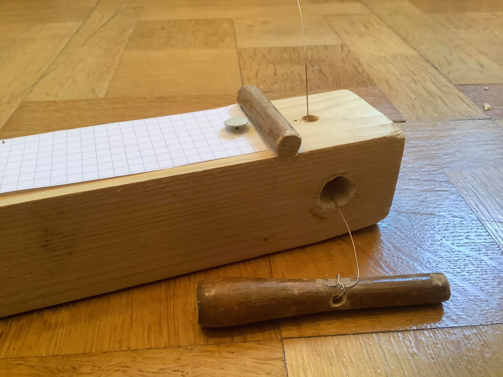
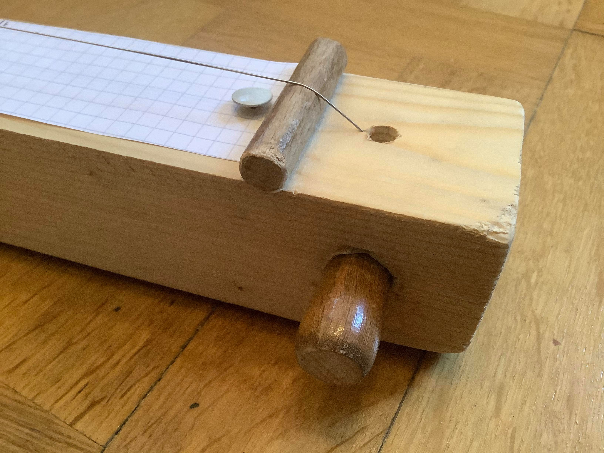
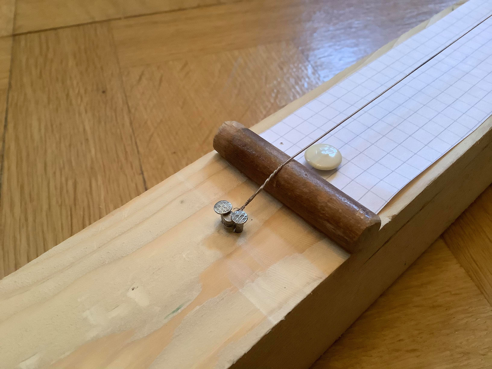
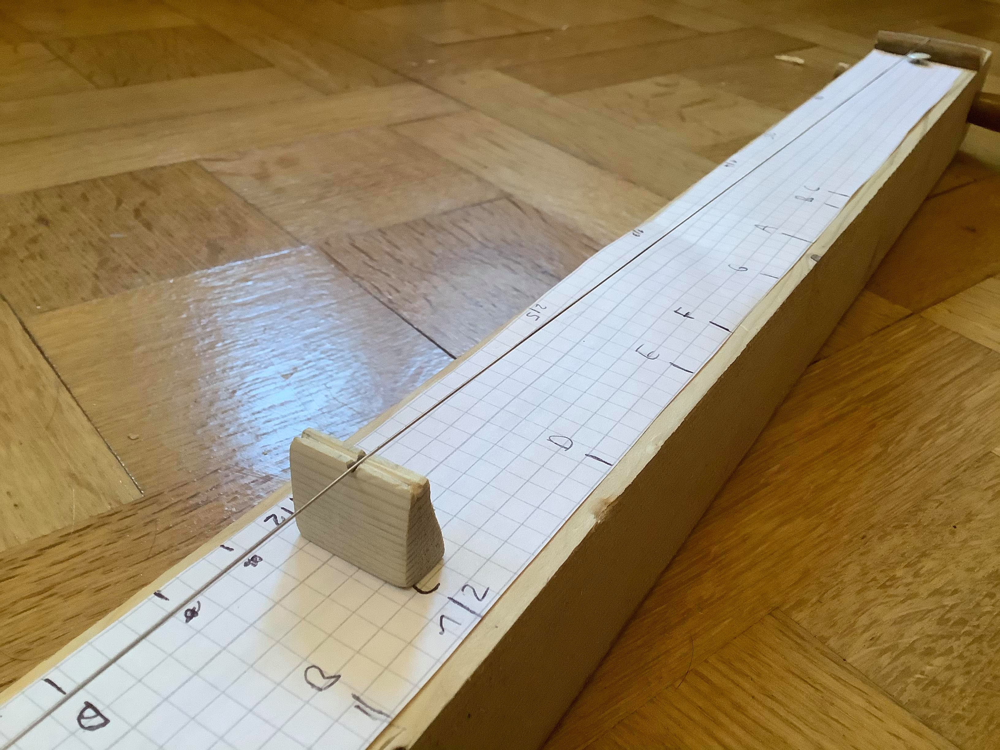

import ReactAudioPlayer from 'react-audio-player';
import Card from '@material-ui/core/Card';
import CardActionArea from '@material-ui/core/CardActionArea';
import CardMedia from '@material-ui/core/CardMedia';
import CardContent from '@material-ui/core/CardContent';
import Typography from '@material-ui/core/Typography';
import { makeStyles } from '@material-ui/core/styles';
const useStyles = makeStyles({
  root: {
    maxWidth: 345
  },
  media: {
    height: 140
  }
});
import open from './audio/Open.m4a';
import vibrato from './audio/Vibrato.m4a';
import h1 from './audio/1st Harmonic.m4a';
import h2 from './audio/2nd Harmonic.m4a';
import h3 from './audio/3rd Harmonic.m4a';
import h4 from './audio/4th Harmonic.m4a';
import h5 from './audio/5th Harmonic.m4a';
import h6 from './audio/6th Harmonic.m4a';
import h7 from './audio/7th Harmonic.m4a';
import h8 from './audio/8th Harmonic.m4a';
import h9 from './audio/9th Harmonic.m4a';
import h10 from './audio/10th Harmonic.m4a';
import unison from './audio/Unison.m4a';
import octave from './audio/Octave.m4a';
import fifth from './audio/Fifth.m4a';
import fourth from './audio/Fourth.m4a';
import third from './audio/Third.m4a';
const harmonics = [h1, h2, h3, h4, h5, h6, h7, h8, h9, h10];
const intervals = [unison, third, fifth, octave];

After fiddling around with digital monochords and cheap web audio sounds,
I decided to give my build a physical monochord from scrap wood to test if the real world is actually as I imagine it to be, and to give my ears a rest from beep noises.

## Construction

Here you can see how I made the tuning peg with a conic piece of wood:

To elevate the string, I limed the bridge into a dent I made with a round file.
This is how it looks like with the peg and string in position:

On the other side, I made another bridge and fixed the string with two nails:

To adjust the length ratio on the string, I clamped a little wooden triangle under it:

I also pinned a sheet of paper under the string marked certain ratios / pitches.

## Observations

As I now have made Monochords in the mathematically clean virtual world and the grimy real world, here are some real world string observations:

### String Tension

At first, I compared the pitch of the open string with the pitch of the exact halves, and noticed that the pitch of the halves was a semitone higher, even though the halves themselves had the same pitch (confirming it was really the half and no measurement error).
The reason for this lays in the fact that the little woodpiece increases the string height, and with it the tension, which heightens the overall pitch.

The open string sounds like this:

<ReactAudioPlayer type="audio/x-m4a" src={open} controls />

And the both halves:

<ReactAudioPlayer type="audio/x-m4a" src={unison} controls />

The "problem" goes away if I press the string down on a piece of wood that has just the height of the string, similar to a guitar.

On the other hand, the triangle has a better handling as I don't need to hold it while playing; also I don't need to play with the open string at all, so the triangle is ok.

### Vibrato

If I pluck the string on one side and periodically press the other side down, a vibrato is created.

<ReactAudioPlayer type="audio/x-m4a" src={vibrato} controls />
 
 

### Playing Harmonics

If the string is dampened at the exact center, the fundamental frequency will not sound, as its maximum amplitude is at the center.
The center is also the minimum amplitude of the second harmonic. Generally, if the string is dampened at the minimum amplitude of a partial, we can hear that partial the loudest.

I recorded the first 10 harmonics, using a strong mallet hit while dampening with my finger, and then quickly releasing it after the hit:

<>
  {harmonics.map((harmonic, i) => (
    <ReactAudioPlayer
      key={i}
      type="audio/x-m4a"
      src={harmonic}
      controls
      loop={true}
    />
  ))}
</>
 
 

### Playing intervals

When playing both parts of the divided strings together, intervals can be played.

<>
  {intervals.map((interval, i) => (
    <ReactAudioPlayer
      key={i}
      type="audio/x-m4a"
      src={interval}
      controls
      loop={false}
    />
  ))}
</>

Note that lower pitch gets lower as the upper pitch gets higher. The average pitch will always stay the same. If we think of the unison as C4, the notes are:

| Interval | Lower | Higher |
| -------- | :---: | -----: |
| Unison   |  C4   |     C4 |
| Third    |  Bb3  |     D4 |
| Fifth    |  ~A3  |    ~E4 |
| Octave   |  G3   |     G4 |

## Wrap up

Those are just some observations after building. I will write about the reasons in another post.
Also I want to record more (with better sound quality) and analyze the frequency spectrum.
Overall, building the Monochord was easier than I thought, needing only a few tools, scrap wood and a guitar string.