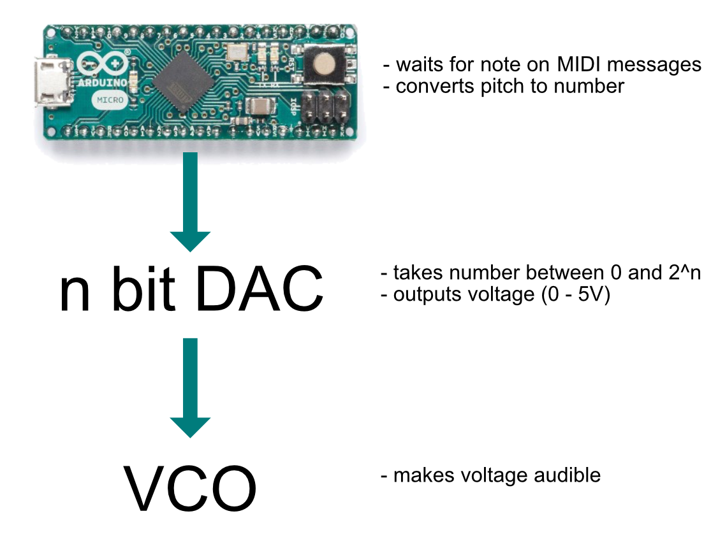
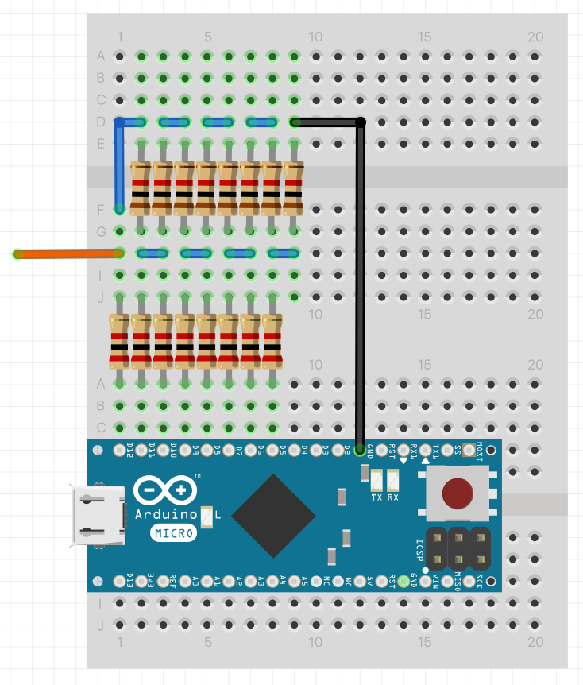
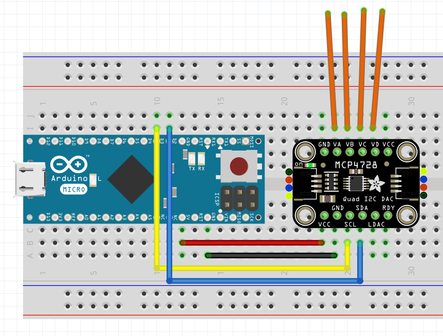
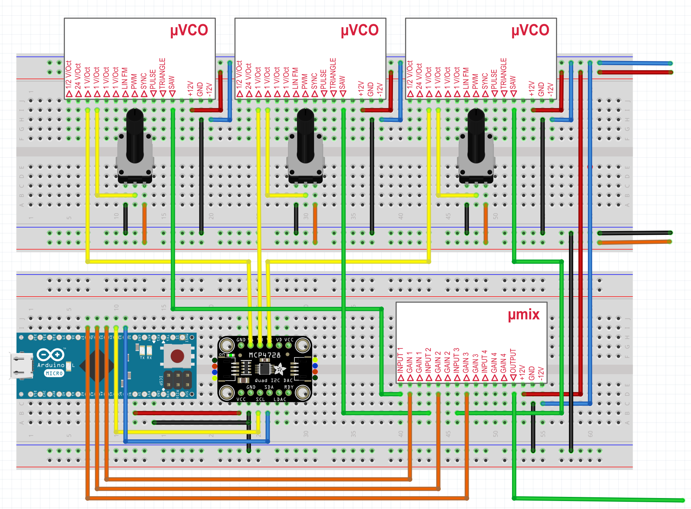

After looking at the basics of analog synthesis in the [last post](./analog-synthesis),
let's now look at how to approach polyphony.

So far, I used the Arturia Keystep to send pitch and gate CV to the VCO.
To be able to play multiple notes at once, we need multiple channels of pitch and gate CV.

## MIDI to CV

Using an Arduino + a DAC (= Digital to Analog Converter), we can set the pitch CV output to an analog voltage whenever a MIDI note message is received:



The Arduino receives a MIDI note message, calculates the correct voltage for that note and sends the voltage through the DAC to the VCO.

## Digital to Analog Conversion

Without a DAC, an Arudino is not able to produce *true analog voltage*™, meaning a voltage that is not either 0V or 5V.

### What about analogWrite?

If you've already worked with Arduino, you might know the analogWrite function, which suggests that we output an analog voltage.
But in fact, analogWrite will only output a [PWM wave](https://www.arduino.cc/en/Tutorial/Foundations/PWM), which looks like this:


So this is still just a digital signal. It can be useful to dim LEDs for example, but it's not sufficient for a VCO.

### Poor Mans DAC

What i heard somewhere referred to as the "Poor Mans DAC", is by filtering the PWM output of the arduino.
This will filter out the higher frequencies of the pulse wave, leaving a more or less mean value.
You can read more about it [here](https://create.arduino.cc/projecthub/Arduino_Scuola/build-a-simple-dac-for-your-arduino-4c00bd).

I tested this too (using a TL074 instead of a TL2451):


The problem: In my test, I could only get a voltage range from 1.7V to 4.4V, which only gives us 3 octaves (at 1V/octave) + the resulting voltage was very shaky.

The next thing I tried was a resistor ladder.

### Resistor Ladder

We can use a bunch of resistors and arrange them to a so called resistor ladder to build a proper DAC:



Essentially, we are using a multi layered [Voltage Divider](https://en.wikipedia.org/wiki/Voltage_divider).
The lower row of resistors are 2K and the upper row are 1K.
To read more on how and why it works, I recommend [this article](https://create.arduino.cc/projecthub/instrumentation-system/dac-8-bit-using-r-2r-ladder-964837).

Using this code:

```c
void setup() {
  pinMode(5, OUTPUT);
  pinMode(6, OUTPUT);
  pinMode(7, OUTPUT);
  pinMode(8, OUTPUT);
  pinMode(9, OUTPUT);
  pinMode(10, OUTPUT);
  pinMode(11, OUTPUT);
  pinMode(12, OUTPUT);
}

void loop() {
  int value = 127; // value between 0 and 255
  int bits = 8;
  for (int i = 0; i < bits; ++i) {
    int digit = bitRead(value, i);
    digitalWrite(5 + i, digit);
  }
}
```

The value can be set between 0 and 255 (= 256 values = 2^8 = 8 bit DAC).
If we measure the voltage, we get approximately 2.5V for 127:


Let's step up the game once more and look at an even better solution, as we would quickly run out of
output pins if we built our multi channel dac with resistor ladders.

### Using the MCP4728

Using an IC DAC, like the MCP4728, we can have 4 channel true analog output without using zillions of output pins.
The integration is much easier with a breakout board, like the one from Adafruit:



Code:

```c
// Basic demo for configuring the MCP4728 4-Channel 12-bit I2C DAC
#include <Adafruit_MCP4728.h>
#include <Wire.h>

Adafruit_MCP4728 mcp;

void setup(void) {
  Serial.begin(115200);
  while (!Serial)
    delay(10); // will pause Zero, Leonardo, etc until serial console opens

  Serial.println("Adafruit MCP4728 test!");

  // Try to initialize!
  if (!mcp.begin()) {
    Serial.println("Failed to find MCP4728 chip");
    while (1) {
      delay(10);
    }
  }

  mcp.setChannelValue(MCP4728_CHANNEL_A, 4095);
  mcp.setChannelValue(MCP4728_CHANNEL_B, 2048);
  mcp.setChannelValue(MCP4728_CHANNEL_C, 1024);
  mcp.setChannelValue(MCP4728_CHANNEL_D, 0);
}

void loop() { delay(1000); }
```

Reading Channel B:


For a full tutorial see [this page](https://learn.adafruit.com/adafruit-mcp4728-i2c-quad-dac).

## Handling MIDI Messages

Now that we have 4 12 bit output channels, we can think about how to translate a midi message to voltage.
To simplify MIDI handling, we can use the [MIDIUSB library](https://www.arduino.cc/en/Reference/MIDIUSB).

Taken from [this example](https://github.com/arduino-libraries/MIDIUSB/blob/master/examples/MIDIUSB_buzzer/MIDIUSB_buzzer.ino),
we can read incoming midi messages like so:

```c
#include "MIDIUSB.h"
#include <Adafruit_MCP4728.h>
#include <Wire.h>

void loop() {
  midiEventPacket_t rx;
  rx = MidiUSB.read();

  switch (rx.header) {
    case 0:
      break; //No pending events

    case 0x9:
      noteOn(
        rx.byte1 & 0xF,  //channel
        rx.byte2,        //pitch
        rx.byte3         //velocity
      );
      break;

    case 0x8:
      noteOff(
        rx.byte1 & 0xF,  //channel
        rx.byte2,        //pitch
        rx.byte3         //velocity
      );
      break;

    case 0xB:
      controlChange(
        rx.byte1 & 0xF,  //channel
        rx.byte2,        //control
        rx.byte3         //value
      );
      break;
  }
}
```

### MIDI note to Voltage

In the noteOn method, we receive the pitch as MIDI note number:

```c
int midiOffset = 24;

int getStep(byte pitch) {
  int steps = 4095;
  int octaves = 5;
  return max(0, min(round(steps / (octaves * 12) * (pitch - midiOffset)), steps));
}

void noteOn(byte midiChannel, byte pitch, byte velocity) {
  mcp.setChannelValue(MCP4728_CHANNEL_A, getStep(pitch));
}

// rest of code in last snippet
```

Now we can use the output channel A to control a VCO via MIDI!

## Make it polyphonic!

Using the vco micromodules [introduced in the last post](../analog-synthesis),
we can create a 3 oscillator setup like this:



- Channels A, B and C of the DAC go the the VCOs 1V/oct inputs
- Pots allow tuning the oscillators
- The saw outputs of the oscillators are mixed together using the [mix module](https://syntaxis.com.pl/en/micromodules/107-umix-481-exp-a.html)
- Digital Pins 4, 5, 6 of the Arduino are connected to the gate of the mix mixodule

### Voice Allocation

As we have only 3 oscillators, we need some logic that allocates each of them to incoming notes.
To do that, we need the following variables:

```c
int channels = 3;
int pressed[] = { -1, -1, -1}; // which notes are allocated on which channel, -1 = none
int gates[] = { 6, 5, 4}; // which pins correspond to which channel gate
```

In the noteOn method, we can iterate over the pressed array and allocate the first unused channel to the incoming note:

```c
void noteOn(byte midiChannel, byte pitch, byte velocity) {
  int channel = -1;
  for (int i = 0; i < channels; i++) {
    if (pressed[i] == -1 && channel == -1) {
      channel = i;
      pressed[i] = pitch;
      digitalWrite(gates[channel], HIGH);
      mcp.setChannelValue(channel, getStep(pitch));
    }
  }
}
```

When the note is released, we have to revert what we did:

```c
void noteOff(byte midiChannel, byte pitch, byte velocity) {
  int channel = -1;
  for (int i = 0; i < channels; i++) {
    if (pressed[i] == pitch && channel == -1) {
      channel = i;
      digitalWrite(gates[channel], LOW);
      pressed[channel] = -1;
    }
  }
}
```

And that's all we need for polyphonic CV messages!

## TODO

- add sound example
- add vcf + adsr via orGate + LEDs
- compare to prophet

## Future Ideas

- note stealing
- autotune
  - https://github.com/PaulStoffregen/FreqCount
  - https://simple-circuit.com/arduino-frequency-counter-project/
- https://bastl-instruments.com/eurorack/modules/1983
- https://www.soundonsound.com/techniques/introducing-polyphony
