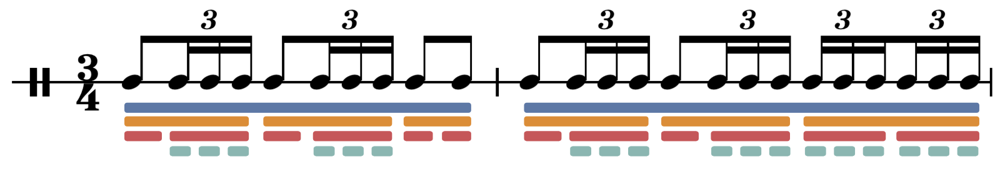

import { piano } from '../instruments/piano.ts';
import { MK2md2 } from '../instruments/rhodes.ts';
import swimming from '../components/rhythmical/tunes/swimming.ts';
import tetris from '../components/rhythmical/tunes/tetris.ts';
import tetrisQuiet from '../components/rhythmical/tunes/tetrisQuiet.ts';
import { marblemachine } from '../components/rhythmical/tunes/marblemachine.ts';
import { rhythmEvents } from '../components/rhythmical/hierarchy.ts';
import { flatEvents } from '../components/rhythmical/walker.ts';
import { renderRhythm, flatRhythm } from '../components/rhythmical/rhythmical.ts';
import { renderEvents } from '../components/rhythmical/RhythmZipper.ts';
import { digRhythm } from '../components/rhythmical/digRhythm.ts';
import { transpose, transposeEvents, transposeEvent } from '../components/rhythmical/features/transpose.ts';
import { tieEvents } from '../components/rhythmical/reducers.ts';
import { inheritProp, inherit } from '../components/rhythmical/features/inherit.ts';
import tinypiano from '../instruments/tinypiano.ts';
import Player, { click } from '../components/rhythmical/components/Player.tsx';
import compose from 'ramda/src/compose';
import pipe from 'ramda/src/pipe';
import map from 'ramda/src/map';
import RhythmicalTree, {
  rhythmicalHierarchy,
  rhythmicalTree,
} from '../components/rhythmical/components/RhythmicalTree.tsx';
import Tree, { colorizePath } from '../components/rhythmical/components/Tree.tsx';
import { TreeAnalyzer } from '../components/rhythmical/components/TreeAnalyzer.tsx';
import { rhythmicalScore } from '../components/score/score.ts';
import { Score } from '../components/score/Score.tsx';
import { Color } from '../components/common/Color.tsx';
import { schemeTableau10 } from 'd3-scale-chromatic';
import { InlineMath, BlockMath } from 'react-katex';
import { toRhythmObject, getRhythmChildren, colorize, addColors, pathString } from '../components/rhythmical/util';
import { State } from 'react-powerplug';
import Fraction from 'fraction.js';
import Switch from '@material-ui/core/Switch';

export const bolero = [
  [
    ['sn', ['sn', 'sn', 'sn']],
    ['sn', ['sn', 'sn', 'sn']],
    ['sn', 'sn'],
  ],
  [
    ['sn', ['sn', 'sn', 'sn']],
    ['sn', ['sn', 'sn', 'sn']],
    [
      ['sn', 'sn', 'sn'],
      ['sn', 'sn', 'sn'],
    ],
  ],
];
export const conventionalLabels = ['bolero', '3/4', '1/4', '1/8', '/24'];
export const absoluteLabels = ['bolero', '3/3', '1/3', '1/6', '/18'];
export const relativeLabels = ['bolero', '1', '1/3', '1/2', '1/3'];

<!--<Player fold={true} instruments={{ MK2md2 }} events={renderEvents(tetris)} />-->

After the posts about [Rhythmical Arrays](../rhythmical-arrays/) and [Rhythmical Objects](../rhythmical-objects),
I want to investigate the actual data structure that is at play: trees.
This is an attempt to explain why trees are the most elegant way to represent rhythm and music.

## Tree Basics

This is a tree:

<TreeAnalyzer
  data={{
    name: '1',
    children: [
      { name: '2', children: [{ name: '5' }, { name: '6' }] },
      { name: '3', children: [{ name: '7' }, { name: '8' }] },
      { name: '4', children: [{ name: '9' }, { name: '10' }] },
    ],
  }}
  hideJson={true}
/>

You can explore it by clicking on different nodes. The color coding should explain itself. If not...

<details>
<summary>show explanation</summary>


<h3>Terminology</h3>

Trees are commonly explained using the following terminology:

- nodes: points of data that are hierarchically linked (circles)
- links: connections between nodes (lines)
- parents: nodes that contain children
- children: nodes that have a parent
- root: the uppermost node (1 per tree), it is the only node without a parent
- leaves: nodes without children

It is common to draw the tree upside down, with the root at the top and the leaves at the bottom.

I implemented the above tree using a [d3 cluster](https://github.com/d3/d3-hierarchy#cluster)

We can represent the above tree with the following object

```js
{
    name: '3/3',
    children: [
      { name: '2', children: [{ name: '5' }, { name: '6' }] },
      { name: '3', children: [{ name: '7' }, { name: '8' }] },
      { name: '4', children: [{ name: '9' }, { name: '10' }] },
    ],
  }
```

</details>
<br/>


## Tree vs Score Notation

Now that we know trees, we can use them to represent rhythms. Let's pick the common Bolero rhythm:

export const colors = schemeTableau10;

<Tree
  width={620}
  nodeRadius={10}
  dx={20}
  columns={[12, 12]}
  data={rhythmicalTree(bolero, (rhythm, path) => ({
    ...toRhythmObject(rhythm),
    color: path.length ? colors[path.length - 1] : 'black',
    name: conventionalLabels[path.length],
  }))}
  hideJson={true}
/>



| color                      | division | type          | amount    | visual cue                  |
| -------------------------- | -------- | ------------- | --------- | --------------------------- |
| <Color color={colors[0]}/> | 3/4      | bar           | 2 total   | seperated by vertical lines |
| <Color color={colors[1]}/> | 1/4      | 4ths          | 3 per bar | separated by space          |
| <Color color={colors[2]}/> | 1/8      | 8ths          | 2 per 4th | connected by first beam     |
| <Color color={colors[3]}/> | 1/24     | 16th triplets | 3 per 8th | connected by second beam    |

<Player
  instruments={{ drums }}
  hierarchy={true}
  height={25}
  fold={true}
  center={0}
  events={renderRhythm(colorize({ duration: 6, sequential: bolero }, colors))}
/>

<!-- <Player
  instruments={{ drums }}
  hierarchy={true}
  height={25}
  fold={true}
  center={0}
  events={renderRhythm(addColors({ duration: 6, sequential: bolero }, colors))}
/> -->

Insights:

- The tree essentially contains the same information as the score, though using less visual encoding (taking more space).
- Each group represents different subdivisions of time
- Each member of a group (color) takes the same amount of time!
- Each fraction is the duration of the member, relative to the length of 4/4

<details>
  <summary>show source</summary>


This is the bolero as text:

```js
const bolero = [
  [
    ['sn', ['sn', 'sn', 'sn']],
    ['sn', ['sn', 'sn', 'sn']],
    ['sn', 'sn'],
  ],
  [
    ['sn', ['sn', 'sn', 'sn']],
    ['sn', ['sn', 'sn', 'sn']],
    [
      ['sn', 'sn', 'sn'],
      ['sn', 'sn', 'sn'],
    ],
  ],
];
```

</details>
<br/>


## Changing Perspective

Currently we were using the fractions 1/4, 1/8 and 1/24 (1/8/3 = 16th triplets) by convention, as they have a visual representation in the traditional western notation system.
In a 3 pulse time, this is overcomplicating things as we have no groupings of 4.
What if we invented a 3/3 meter?

<!-- TBD: enable changing perspective of any group to any fraction + automatically calculate fractions -->

<State initial={{ path: null, node: null, simplify: true }}>
  {({ state, setState }) => (
    <React.Fragment>
      <Tree
        width={620}
        nodeRadius={10}
        dx={20}
        columns={[12, 12]}
        data={rhythmicalTree(bolero, (rhythm, path) => ({
          ...toRhythmObject(rhythm),
          ...colorizePath(state.node, path, colors, 'lightgray'),
          name: (state.simplify ? absoluteLabels : conventionalLabels)[path.length],
        }))}
        onClick={(node) => setState({ node })}
        hideJson={true}
      />
      <label>
        simplify
        <Switch checked={state.simplify} color="primary" onChange={(e) => setState({ simplify: e.target.checked })} />
      </label>
    </React.Fragment>
  )}
</State>

As everything is relative, we can simplify the numbers by multiplying each fraction with 4/3!
This changes just the reference point, while the information stays intact, just more simple (basic fractional algebra).
Now there is one last step to simplify things even more, arriving at a point where the trees really make sense:

### Relative Subdivisions

In the above trees, the fractions were relative to the "absolute 1". What if we change them to be relative to just their parent?
Let's find out:

<State initial={{ path: null, node: null, relative: true }}>
  {({ state, setState }) => (
    <React.Fragment>
      <Tree
        width={620}
        nodeRadius={10}
        dx={20}
        columns={[12, 12]}
        data={rhythmicalTree(bolero, (rhythm, path) => ({
          ...toRhythmObject(rhythm),
          ...colorizePath(state.node, path, colors, 'lightgray'),
          name: (!state.relative ? absoluteLabels : relativeLabels)[path.length],
        }))}
        onClick={(node) => setState({ node })}
        hideJson={true}
      />
      <label>
        relative{' '}
        <Switch checked={state.relative} color="primary" onChange={(e) => setState({ relative: e.target.checked })} />
      </label>
      <p>
        Now we get an interesting effect: the denominators always "coincide" with the amount of elements in a group! To
        get back to the absolute fraction, we just have to multiply all fractions top down:
      </p>
      {!state.node && (
        <p>
          <i>Click a node to show its calculation</i>
        </p>
      )}
      {state.node && (
        <React.Fragment>
          <BlockMath>{`1 * 1/3 * 1/2 * 1/3 = 1/18`}</BlockMath>
          <p>... and to get the "conventional" fraction:</p>
          <BlockMath>{`1/18 * 3/4 = 1/24`}</BlockMath>
        </React.Fragment>
      )}
    </React.Fragment>
  )}
</State>

Note that the important takeaway is not only simplicity, but also independence, as each node value is now only dependent on its parent!

### Index Path

We can identify each node in the tree, by a unique index path:

<State initial={{ path: null, node: null }}>
  {({ state, setState }) => (
    <>
      <Tree
        width={620}
        nodeRadius={10}
        dx={20}
        columns={[12, 12]}
        data={rhythmicalTree(bolero, (rhythm, path) => ({
          ...toRhythmObject(rhythm),
          ...colorizePath(state.node, path, colors, 'lightgray'),
          name: path.length ? path[path.length - 1] : 'bolero',
        }))}
        onClick={(node, setNode) => {
          const path = node
            .ancestors()
            .reverse()
            .slice(1)
            .map((node) => node.data.name);
          setState({ path, node });
        }}
        hideJson={true}
      />
      {!state.node && <i>Click a node to see its path</i>}
      {state.path && <BlockMath>{`path = ${state.path.join(', ')}`}</BlockMath>}
    </>
  )}
</State>

Now let's use that path and combine it with our relative subdivisions:

### Path Fractions

If we divide each index by the number of siblings (relative subdivision), we get this:

<State initial={{ path: null, node: null }}>
  {({ state, setState }) => (
    <>
      <Tree
        width={620}
        nodeRadius={10}
        dx={20}
        columns={[12, 12]}
        onClick={(node) => {
          const path = node
            .ancestors()
            .reverse()
            .slice(1)
            .map((node) => node.data.name);
          const pairs = path.map((p) => p.split('/'));
          const fractions = pairs.map(([a, b]) => new Fraction(a, b));
          const fraction = fractions?.reduce((sum, p, i) => {
            const div = pairs.slice(0, i).map(([_, d]) => d);
            const m = div.reverse().reduce((product, d) => {
              return product.div(d);
            }, p);
            return sum.add(m);
          }, new Fraction(0));
          setState({ path, fraction, node });
        }}
        data={rhythmicalTree(bolero, (rhythm, path, parent) => ({
          ...toRhythmObject(rhythm),
          ...colorizePath(state.node, path, colors, 'lightgray'),
          name: parent ? path[path.length - 1] + '/' + getRhythmChildren(parent).length : 'bolero',
        }))}
        hideJson={true}
      />
      {!state.path && (
        <p>
          <i>Click a node to show its absolute fraction!</i>
        </p>
      )}
      {state.path && (
        <>
          <BlockMath>{`path = ${state.path
            .map((f) => f.split('/'))
            .map(([a, b]) => `\\frac{${a}}{${b}}`)
            .join(', ')}`}</BlockMath>
          <p>The top row reflects the index path, while the bottom row reflects the path of subdivisions!</p>
          <p>We can calculate the absolute fraction like this:</p>
          <BlockMath>
            {`fraction = ${state.path
              .map((f) => f.split('/'))
              .map(
                ([a, b], i, p) =>
                  `${
                    i
                      ? `\\frac{${a}}{${b}}(${p
                          .slice(0, i)
                          .reverse()
                          .map(([x, y]) => `\\frac{1}{${y}}`)
                          .join('')})`
                      : `\\frac{${a}}{${b}}`
                  }`
              )
              .join(' + ')} = \\frac{${state.fraction.n}}{${state.fraction.d}}`}
          </BlockMath>
          <p></p>
        </>
      )}
    </>
  )}
</State>

For each node, we multiply its path fraction (before the bracket) with each parent's relative subdivisions
(inside the brackets). The products are then summed up.
You can read it the same way your eyes would move along the tree line (oscillating down and up).

## Calculating absolute time

With now have all the ingredients to calculate the absolute time and duration for any node.
All we need to know, is the absolute duration of the piece, or in fact, any node.

TBD

### [index, duration, division]

TBD

## How musicians read rhythm

When a musician wants to read and perform a rhythm, he first needs a pulse.
Most of the time, the pulse will be the quarter notes of the piece.
To establish that pulse when playing together, musicians will "count in".
In the bolero example one might count in with a pulse of 60bpm:

<Player
  instruments={{ drums }}
  events={renderRhythm({
    duration: 3.5,
    parallel: [['bd', 'bd', 'bd']],
  })}
/>

Into each pulse now fit 2 8ths notes:

<Player
  instruments={{ drums }}
  events={renderRhythm({
    duration: 3.5,
    parallel: [
      ['bd', 'bd', 'bd'],
      ['ht', 'mt', 'ht', 'mt', 'ht', 'mt'],
    ],
  })}
/>

... and into each 8th notes fit 3 16ths triplets:

<Player
  instruments={{ drums }}
  events={renderRhythm({
    duration: 3.5,
    parallel: [
      ['bd', 'bd', 'bd'],
      ['ht', 'mt', 'ht', 'mt', 'ht', 'mt'],
      ['hh', 'hh', 'hh', 'hh', 'hh', 'hh', 'hh', 'hh', 'hh', 'hh', 'hh', 'hh', 'hh', 'hh', 'hh', 'hh', 'hh', 'hh'],
    ],
  })}
/>

The actual rhythm just switches back and forth between the 8ths and 16ths triplets:

<Player
  instruments={{ drums }}
  events={renderRhythm({
    duration: 7,
    parallel: [
      [
        ['bd', 'bd', 'bd'],
        ['bd', 'bd', 'bd'],
      ],
      [
        ['ht', 'r', 'ht', 'r', 'ht', 'mt'],
        ['ht', 'r', 'ht', 'r', 'r', 'r'],
      ],
      [
        ['r', ['hh', 'hh', 'hh'], 'r', ['hh', 'hh', 'hh'], 'r', 'r'],
        ['r', ['hh', 'hh', 'hh'], 'r', ['hh', 'hh', 'hh'], ['hh', 'hh', 'hh'], ['hh', 'hh', 'hh']],
      ],
    ],
  })}
/>

### Calculating Absolute Durations

If we want to calculate the absolute duration of a subdivision, we need to know how long one beat is.
If we take a tempo of 60bpm, we have:

<BlockMath>{`60 bpm = 60 b/m = 60b/60s = 1b/s`}</BlockMath>

Most of the time, the term beat means one quarter note. With that we can calculate the duration of each subdivision:

<BlockMath>{`1/4 = 1s, 1/8 = 0.5s, 1/24 = 0.16s`}</BlockMath>

### Calculating Absolute Time

If we also knew when each note is played, we have all the information to represent the rhythm as absolute timed events.
As we already know the durations, this is quite easy. We just have to sum all durations that came before.
For example, the second 16th triplet in bar 2 begins at:

<BlockMath>{`3/4 + 1/8 + 1/24 = 0.916s`}</BlockMath>

<!-- TBD: make Tree clickable to calculate the selected node's time -->

## Rhythmical > d3-hierarchy

We can convert a the object to d3-hierarchy format like that:

```ts
export function rhythmicalTree<T>(
  rhythm: RhythmNode<T>,
  mapFn?: (rhythm: RhythmNode<T>, path: number[], parent?: RhythmNode<T>) => RhythmNode<T>,
  path = [],
  parent?
) {
  if (mapFn) {
    rhythm = mapFn(rhythm, path, parent);
  }
  const children = getRhythmChildren(rhythm);
  if (!children?.length) {
    return { name: 'leaf', ...rhythm };
  }
  return {
    name: 'parent',
    children: children.map((child, index) => rhythmicalTree(child, mapFn, path.concat([index]), rhythm)),
    ...rhythm,
  };
}
```

```js
<Tree
  width={620}
  nodeRadius={10}
  dx={20}
  columns={[12, 12]}
  data={rhythmicalTree(bolero, (rhythm, path) => ({
    ...toRhythmObject(rhythm),
    color: path.length ? colors[path.length - 1] : 'black',
    name: conventionalLabels[path.length],
  }))}
  hideJson={true}
/>
```

<Tree
  width={620}
  nodeRadius={10}
  dx={20}
  columns={[12, 12]}
  data={rhythmicalTree(bolero, (rhythm, path) => ({
    ...toRhythmObject(rhythm),
    color: path.length ? colors[path.length - 1] : 'black',
    name: conventionalLabels[path.length],
  }))}
  hideJson={true}
/>

## links / BTD

- use https://observablehq.com/@d3/radial-dendrogram
- implement https://github.com/0xfe/vexflow/wiki/Tuplets for score
- add paths to trees https://css-tricks.com/svg-path-syntax-illustrated-guide/

## todo

### implement stateful tree walker

- generator function that walks one node per call
- enables "debugging" tree walker with Tree component
- could show different states on the side
- the generator could also be used to run inside a tone.js loop to "buffer" events as long as required
  - this would eliminate loop errors => for example, the first chord could then be voiced based on the last
  - the walker could be adjusted to be a "runtime", that allows jumps (to implement control flow)
  - maybe a zipper like implementation would then be needed
  - nevertheless, the stateful tree walker should still be implemented!!!

### PianoRoll

- add mode for PianoRoll where non-leaves are rendered => display bolero with group colors
- add mode for PianoRoll where nothing is scrolling, just the playhead is moving
- place non-scrolling PianoRoll with 0s on the left under the bolero score to replace colored bars
- auto select nodes in the graph while playing (to show correlation)

### Tree / RhythmInspector

- adapt rhythmicalHierarchy, making it work with rhythmical objects too (currently array only)
- add mode for Tree where clicking a node results in all the parent nodes being colored (+ node itself)
- add RhythmInspector, which is a rhythmical Tree that enables selecting nodes

## RhythmEditor

- add RhythmEditor, which is Player + JSON editor + RhythmInspector, that automatically updates
- Make RhythmInspector editable
  - nodes can be disabled (won't play + will loose color)
  - nodes can be edited => change value, set instrument, velocity, duration etc..

## Score

- improve Score component to allow rhythmical objects too (currently array only)
- improve Score component to show tuplets
- replace bolero.png with Score + color note heads + stems + beams according to group

## Claims

1. Trees are the shortest and most natural way to represent rhythmical information
2. As text, they are extremely readable and portable
3. When implemented correctly, they offer great possibilities for algorithmic composition
