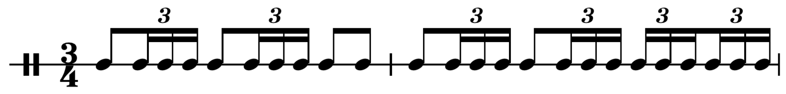

import { Chord } from '@tonaljs/tonal';
import { piano } from '../instruments/piano.ts';
import { MK2md2 } from '../instruments/rhodes.ts';
import tetris from '../components/rhythmical/tunes/tetris.ts';
import tetrisQuiet from '../components/rhythmical/tunes/tetrisQuiet.ts';
import { marblemachine } from '../components/rhythmical/tunes/marblemachine.ts';
import { rhythmEvents } from '../components/rhythmical/tree/hierarchy.ts';
import { renderRhythm } from '../components/rhythmical/rhythmical.ts';
import { generateVoicings, voicingFactory } from '../components/rhythmical/voicings/generateVoicings.ts';
import { lefthand } from '../components/rhythmical/voicings/dictionary.ts';
import Player from '../components/rhythmical/components/Player.tsx';
import Tree from '../components/rhythmical/components/Tree.tsx';
import { TreeAnalyzer } from '../components/rhythmical/components/TreeAnalyzer.tsx';
import { Color } from '../components/common/Color.tsx';
import TreeVisitor from '../components/common/TreeVisitor.tsx';
import { schemeTableau10 } from 'd3-scale-chromatic';
import { BlockMath } from 'react-katex';
import { toRhythmObject, haveSameIndices } from '../components/rhythmical/util';
import { r2d3, ro2d3 } from '../components/rhythmical/tree/r2d3';
import { colorize } from '../components/rhythmical/tree/colorize';
import { State } from 'react-powerplug';
import Fraction from 'fraction.js';
import { bolero, conventionalLabels } from '../components/rhythmical/tunes/bolero';
import R from 'ramda';
import NestedGrid from '../components/graphs/NestedGrid';

After the posts about [Rhythmical Arrays](../rhythmical-arrays/) and [Rhythmical Objects](../rhythmical-objects),
I want to investigate the actual data structure that is at play: trees.
This is an attempt to explain why trees are a really elegant way to represent rhythm and music.

## Tree Basics

This is a tree:


Now if we turn this upside down, cut of the stem and draw it like a 3 year old, we get what computer scientists call a tree:

<TreeAnalyzer
  data={{
    name: '1',
    children: [
      { name: '2', children: [{ name: '5' }, { name: '6' }] },
      { name: '3', children: [{ name: '7' }, { name: '8' }] },
      { name: '4', children: [{ name: '9' }, { name: '10' }] },
    ],
  }}
  hideJson={true}
/>

You can learn the basic terminology by exploration. Just click on different nodes and watch what happens. The color coding should explain itself. If not...

<details>
<summary>show explanation</summary>

<h3>Terminology</h3>

Trees are commonly explained using the following terminology:

- nodes: points of data that are hierarchically linked (circles)
- links: connections between nodes (lines)
- parents: nodes that contain children
- children: nodes that have a parent
- root: the uppermost node (1 per tree), it is the only node without a parent
- leaves: nodes without children

It is common to draw the tree upside down, with the root at the top and the leaves at the bottom.

I implemented the above tree using a [d3 cluster](https://github.com/d3/d3-hierarchy#cluster)

We can represent the above tree with the following object

```js
{
    name: '1',
    children: [
      { name: '2', children: [{ name: '5' }, { name: '6' }] },
      { name: '3', children: [{ name: '7' }, { name: '8' }] },
      { name: '4', children: [{ name: '9' }, { name: '10' }] },
    ],
  }
```

</details>
<br/>

## Visual: Tree vs Score

Let's ignite a visual explosion of a score notation, using the common Bolero rhythm as an example:

export const colors = schemeTableau10;

<Tree
  width={620}
  nodeRadius={10}
  dx={20}
  columns={[12, 12]}
  data={r2d3(bolero, (rhythm, path) => ({
    ...toRhythmObject(rhythm),
    color: path.length ? colors[path.length - 1] : 'black',
    name: conventionalLabels[path.length],
  }))}
  hideJson={true}
/>


| color                      | value | type          | amount    | visual cue                  |
| -------------------------- | ----- | ------------- | --------- | --------------------------- |
| <Color color={colors[0]}/> | 3/4   | bar           | 2 total   | seperated by vertical lines |
| <Color color={colors[1]}/> | 1/4   | 4ths          | 3 per bar | separated by space          |
| <Color color={colors[2]}/> | 1/8   | 8ths          | 2 per 4th | connected by first beam     |
| <Color color={colors[3]}/> | 1/24  | 16th triplets | 3 per 8th | connected by second beam    |

<!--
<NestedGrid
  rows={[1]}
  innerBorders={true}
  outerBorders={false}
  cells={[
    [
      ['sn', ['sn', 'sn', 'sn']],
      ['sn', ['sn', 'sn', 'sn']],
      ['sn', 'sn'],
    ],
    [
      ['sn', ['sn', 'sn', 'sn']],
      ['sn', ['sn', 'sn', 'sn']],
      [
        ['sn', 'sn', 'sn'],
        ['sn', 'sn', 'sn'],
      ],
    ],
  ]}
/> -->

<Player
  instruments={{ drums }}
  hierarchy={true}
  height={25}
  fold={true}
  center={0}
  events={renderRhythm(colorize({ duration: 6, sequential: bolero }, colors))}
/>

- The tree essentially contains the same information as the score, though using less visual encoding (taking more space).
- Each group represents different subdivisions of time
- Each member of a group (color) takes the same amount of time!
- Each fraction is the duration of the member, relative to the length of 4/4

## Textual: Nested vs Flat

Let's oppose two possible textual representations of the bolero:

### Nested

As JSON, this is the most compact and readable version I can think of:

```json
[
  [
    ["sn", ["sn", "sn", "sn"]],
    ["sn", ["sn", "sn", "sn"]],
    ["sn", "sn"],
  ],
  [
    ["sn", ["sn", "sn", "sn"]],
    ["sn", ["sn", "sn", "sn"]],
    [["sn", "sn", "sn"], ["sn", "sn", "sn"]],
  ],
];
```



The nesting of the braces directly resembles the structure of the notes.
To understand more about this syntax, check out my post about [Rhythmical Arrays](../rhythmical-arrays).

### Flat

A more machine readable version looks like this:

```json
[
  ["sn", 0, 0.75],
  ["sn", 0.75, 0.25],
  ["sn", 1, 0.25],
  ["sn", 1.25, 0.25],
  ["sn", 1.5, 0.75],
  ["sn", 2.25, 0.25],
  ["sn", 2.5, 0.25],
  ["sn", 2.75, 0.25],
  ["sn", 3, 0.75],
  ["sn", 3.75, 0.75],
  ["sn", 4.5, 0.75],
  ["sn", 5.25, 0.25],
  ["sn", 5.5, 0.25],
  ["sn", 5.75, 0.25],
  ["sn", 6, 0.75],
  ["sn", 6.75, 0.25],
  ["sn", 7, 0.25],
  ["sn", 7.25, 0.25],
  ["sn", 7.5, 0.25],
  ["sn", 7.75, 0.25],
  ["sn", 8, 0.25],
  ["sn", 8.25, 0.25],
  ["sn", 8.5, 0.25],
  ["sn", 8.75, 0.25]
]
```

This is an absolute representation of the bolero at 45 bpm (quite slow, but has the nicest looking floats..).
The format is `[value, time, duration]`. While it is readable for machines, it is quite unpractical for humans..

_The important question_: How can we transform the first notation into the second?
With it, the human interface would be the first, while the second one would be used for rendering / playback.

## Calculating Absolute Time & Duration

Let's find out how to calculate the absolute time and duration for each node, based on the tree.

### Fraction Paths

Let's identify each node by the index in its group of children:

<State initial={{ node: null }}>
  {({ state, setState }) => (
    <>
      <TreeVisitor
        onNode={(node) => {
          setState({ node });
        }}
        tree={(node, visited) =>
          r2d3(bolero, (rhythm, path, parent) => {
            path = path.map((p) => p[0]);
            const isRoot = !path.length;
            let color = 'darkgray';
            const strPath = (p) => p?.join(' ') || '';
            const isParent = strPath(node?.path).startsWith(strPath(path));
            const isSelected = haveSameIndices(node?.path, path);
            const isVisited = visited.find((v) => haveSameIndices(v.path, path));
            if (isVisited) {
              color = 'lightgray';
            }
            if (isParent || isSelected) {
              color = isRoot ? 'darkgray' : 'red';
            }
            return {
              ...toRhythmObject(rhythm),
              color,
              name: parent ? path[path.length - 1] : 'bolero',
              path: [...path],
            };
          })
        }
      />
      {!state.node?.path?.length && (
        <p>
          <i>Click step to walk the tree</i>
        </p>
      )}
      {!!state.node?.path?.length && <BlockMath>{`path = [${state.node.path.join(', ')}]`}</BlockMath>}
    </>
  )}
</State>
<br />

- When stepping into the tree, the path of indices uniquely identifies each node
- This path will help us to calculate time and duration

### Calculating Durations

Let's divide each index by the number of children in that group:

export const parentTree = (node, visited) => {
  return r2d3(bolero, (rhythm, path, parent) => {
    const isSelected = haveSameIndices(node?.path, path);
    const strPath = (p) => p?.map((s) => s.join('/')).join(' ') || '';
    let color = 'darkgray';
    const isRoot = !path.length;
    const isVisited = visited.find((v) => haveSameIndices(v.path, path));
    if (isVisited) {
      color = 'lightgray';
    }
    if (isSelected) {
      color = 'red';
    }
    const isParent = strPath(node?.path).startsWith(strPath(path));
    if (isParent && !isSelected) {
      color = isRoot ? 'darkgray' : 'red';
    }
    return {
      ...toRhythmObject(rhythm),
      color,
      name: parent ? path[path.length - 1].join('/') : '1/1',
      path: [...path],
    };
  });
};

<State initial={{ node: null, calculation: null }}>
  {({ state, setState }) => (
    <>
      <TreeVisitor
        onNode={(node) => {
          if (!node) {
            setState({ node: null, calculation: null });
            return;
          }
          const { path: pairs } = node;
          const F = (n, d) => new Fraction(n, d);
          const duration = pairs
            //.concat([[1, 1]])
            .map(([a, b]) => `\\frac{${a || 1}}{${b || 1}}`)
            .join('*');
          const d = pairs.reduce((product, [a, b]) => product.mul(F(1, b)), F(1, 1));
          const time = pairs
            .map(([a, b], i, p) =>
              i
                ? `\\frac{${a}}{${b}}*(${p
                    .slice(0, i)
                    .reverse()
                    .map(([x, y]) => `\\frac{1}{${y}}`)
                    .join('*')})`
                : `\\frac{${a}}{${b}}`
            )
            .join(' + ');
          const t = pairs
            .map(([a, b]) => F(a, b))
            .reduce((sum, p, i) => {
              const div = pairs.slice(0, i).map(([_, d]) => d);
              const m = div.reverse().reduce((product, d) => {
                return product.div(d);
              }, p);
              return sum.add(m);
            }, new Fraction(0));
          const whole = 6;
          const ta = t.mul(6).toFraction(false);
          const da = d.mul(6).toFraction(false);
          const cd = F(6, 4).mul(F(d.n, d.d));
          const ct = F(6, 4).mul(F(t.n, t.d));
          const calculation = (
            <React.Fragment>
              <p>The duration relative to the complete bolero length is:</p>
              <BlockMath>{`duration_{r} = ${pairs.length > 1 ? duration + ' = ' : ''}\\frac{${d.n}}{${
                d.d
              }}`}</BlockMath>
              <p>If 1 bolero takes 6s, the absolute duration of this node is:</p>
              <BlockMath>{`duration_{a} = \\frac{${d.n}}{${d.d}} * 6s = ${da}s`}</BlockMath>
            </React.Fragment>
          );
          setState({ node, calculation });
        }}
        tree={parentTree}
      />
      {!state.node && (
        <p>
          <i>Click step to walk the tree (prepare for math...)</i>
        </p>
      )}
      {state.node && (
        <BlockMath>{`path = [${state.node.path
          //.concat([[1, 1]])
          .map(([a, b]) => `\\frac{${a}}{${b}}`)
          .join(', ')}]`}</BlockMath>
      )}
      {state.calculation && <>{state.calculation}</>}
    </>
  )}
</State>
<br />

- If we divide each node index by the total number of children (also called branching factor), we get a fraction that represents the duration of each node in its group.
- By multiplying that fraction with all the fractions of the node's parents, we get the relative duration fraction.
- We can calculate the absolute duration by multiplying that relative duration by the total length of everything:

### Calculating Time

To complete our mission, we need the absolute time for each node.
The process is similar to calculating durations, with a slightly more complicated looking calculation:

<State initial={{ node: null, calculation: null }}>
  {({ state, setState }) => (
    <>
      <TreeVisitor
        onNode={(node) => {
          if (!node) {
            setState({ node: null, calculation: null });
            return;
          }
          const { path: pairs } = node;
          const F = (n, d) => new Fraction(n, d);
          const duration = pairs.map(([a, b]) => `\\frac{${a || 1}}{${b || 1}}`).join('*');
          const d = pairs.reduce((product, [a, b]) => product.mul(F(1, b)), F(1, 1));
          const time = pairs
            .map(([a, b], i, p) =>
              i
                ? `\\frac{${a}}{${b}}*(${p
                    .slice(0, i)
                    .reverse()
                    .map(([x, y]) => `\\frac{1}{${y}}`)
                    .join('*')})`
                : `\\frac{${a}}{${b}}`
            )
            .join(' + ');
          const t = pairs
            .map(([a, b]) => F(a, b))
            .reduce((sum, p, i) => {
              const div = pairs.slice(0, i).map(([_, d]) => d);
              const m = div.reverse().reduce((product, d) => {
                return product.div(d);
              }, p);
              return sum.add(m);
            }, new Fraction(0));
          const timeSimple = t.n ? `\\frac{${t.n}}{${t.d}}` : `0`;
          const whole = 6;
          const ta = t.mul(6).toFraction(false);
          const da = d.mul(6).toFraction(false);
          const cd = F(6, 4).mul(F(d.n, d.d));
          const ct = F(6, 4).mul(F(t.n, t.d));
          const calculation = (
            <React.Fragment>
              <p>The time relative to the complete bolero is:</p>
              <BlockMath>{`time_{r} = ${time} = ${timeSimple}`}</BlockMath>
              <p>If 1 bolero take 6s, the absolute time of this node is:</p>
              <BlockMath>{`time_{a} = ${timeSimple} * 6s = ${ta}s`}</BlockMath>
            </React.Fragment>
          );
          setState({ node, calculation });
        }}
        tree={parentTree}
      />
      {!state.node && (
        <p>
          <i>Click step to walk the tree (prepare for math...)</i>
        </p>
      )}
      {state.node && (
        <BlockMath>{`path = [${state.node.path.map(([a, b]) => `\\frac{${a}}{${b}}`).join(', ')}]`}</BlockMath>
      )}
      {state.calculation && <>{state.calculation}</>}
    </>
  )}
</State>
<br />

- to calculate the relative time fraction, we need to sun the relative timse of each node in the path

## Variable Durations

In the bolero example, there are no duration fractions with a numerator other than 1.
To be able to cover any rhythm of this world, we need to extend our paths.

import { Score } from '../components/score/Score.tsx';
import { rhythmicalScore } from '../components/score/score.ts';

Take this as an example:

<Score
  width={400}
  height={100}
  staves={[
    [
      ['C4', '2d'],
      ['D4', 'q'],
    ],
    [
      ['E4', 'q'],
      ['D4', '2'],
      ['B3', 'q'],
    ],
  ]}
/>

To be able to express that as a nested array, we need a way to declare durations, for example:

```json
[
  ["C4*3", "D4"],
  ["E4", "D4*2", "B3"]
]
```

If we just represent the durations as a tree, it looks like this:

<Tree
  width={620}
  nodeRadius={10}
  dx={20}
  columns={[12, 12]}
  data={ro2d3(
    [
      [{ value: 'C4', duration: 3 }, 'D4'],
      ['E4', { value: 'D4', duration: 2 }, 'B3'],
    ],
    (rhythm, path) => ({
      ...toRhythmObject(rhythm),
      color: path.length ? colors[path.length - 1] : 'black',
      name: path.length ? `${path[path.length - 1][2]}` : '1',
      path: [...path],
    })
  )}
  hideJson={true}
/>

### Calculating Variable Durations

Now, to get the correct fractions, we cannot just use the indices like before.
Instead, we can use the duration as the numerator and the sum of all durations for the denominator:

<State initial={{ node: null }}>
  {({ state, setState }) => (
    <>
      <TreeVisitor
        onNode={(node) => {
          if (!node) {
            setState({ node: null, calculation: null });
            return;
          }
          const { path: pairs } = node;
          const F = (n, d) => new Fraction(n, d);
          const duration = pairs
            //.concat([[1, 1]])
            .map(([_, b, a]) => `\\frac{${a || 1}}{${b || 1}}`)
            .join('*');
          const d = pairs.reduce((product, [_, b, a]) => product.mul(F(a || 1, b)), F(1, 1));
          const whole = 8;
          const da = d.mul(whole).toFraction(false);
          const cd = F(whole, 4).mul(F(d.n, d.d));
          const calculation = (
            <React.Fragment>
              <p>The duration relative to the length is:</p>
              <BlockMath>{`duration_{r} = ${pairs.length > 1 ? duration + ' = ' : ''}\\frac{${d.n}}{${
                d.d
              }}`}</BlockMath>
              <p>If the whole takes 8s, the absolute duration of this node is:</p>
              <BlockMath>{`duration_{a} = \\frac{${d.n}}{${d.d}} * 8s = ${da}s`}</BlockMath>
            </React.Fragment>
          );
          setState({ node, calculation });
        }}
        tree={(node, visited) =>
          ro2d3(
            [
              [{ value: 'C4', duration: 3 }, 'D4'],
              ['E4', { value: 'D4', duration: 2 }, 'B3'],
            ],
            (rhythm, path) => {
              const isRoot = !path.length;
              let color = 'darkgray';
              const strPath = (p) => p?.map((s) => s.join('/')).join(' ') || '';
              const isParent = strPath(node?.path).startsWith(strPath(path));
              const isSelected = haveSameIndices(node?.path, path);
              const isVisited = visited.find((v) => haveSameIndices(v.path, path));
              if (isVisited) {
                color = 'lightgray';
              }
              if (isSelected || (isParent && !isRoot)) {
                color = 'red';
              }
              return {
                ...toRhythmObject(rhythm),
                color,
                name: path.length ? `${path[path.length - 1][2]}/${path[path.length - 1][1]}` : '1',
                path: [...path],
              };
            }
          )
        }
        hideJson={true}
      />
      {state.calculation}
    </>
  )}
</State>

### Calculating Time With Variable Durations

To know calculate the time fraction, we need to sum all durations that came before:

<State initial={{ node: null }}>
  {({ state, setState }) => (
    <>
      <TreeVisitor
        onNode={(node) => {
          if (!node) {
            setState({ node: null, calculation: null });
            return;
          }
          const { path: pairs } = node;
          const F = (n, d) => new Fraction(n, d);
          const duration = pairs.map(([a, b]) => `\\frac{${a || 1}}{${b || 1}}`).join('*');
          const d = pairs.reduce((product, [a, b]) => product.mul(F(a || 1, b)), F(1, 1));
          const time = pairs
            .map(([a, b], i, p) =>
              i
                ? `\\frac{${a || 1}}{${b}}*(${p
                    .slice(0, i)
                    .reverse()
                    .map(([x, y]) => `\\frac{${x}}{${y}}`)
                    .join('*')})`
                : `\\frac{${a}}{${b}}`
            )
            .join(' + ');
          const t = pairs
            .map(([a, b]) => F(a, b))
            .reduce((sum, p, i) => {
              const div = pairs.slice(0, i).map(([_, d]) => d);
              const m = div.reverse().reduce((product, d) => {
                return product.div(d);
              }, p);
              return sum.add(m);
            }, new Fraction(0));
          const timeSimple = t.n ? `\\frac{${t.n}}{${t.d}}` : `0`;
          const whole = 8;
          const ta = t.mul(whole).toFraction(false);
          const da = d.mul(whole).toFraction(false);
          const cd = F(whole, 4).mul(F(d.n, d.d));
          const ct = F(whole, 4).mul(F(t.n, t.d));
          const calculation = (
            <React.Fragment>
              <p>The time relative to the whole is:</p>
              <BlockMath>{`time_{r} = ${time} = ${timeSimple}`}</BlockMath>
              <p>If the whole takes 8s, the absolute time of this node is:</p>
              <BlockMath>{`time_{a} = ${timeSimple} * 8s = ${ta}s`}</BlockMath>
            </React.Fragment>
          );
          setState({ node, calculation });
        }}
        tree={(node, visited) =>
          ro2d3(
            [
              [{ value: 'C4', duration: 3 }, 'D4'],
              ['E4', { value: 'D4', duration: 2 }, 'B3'],
            ],
            (rhythm, path) => {
              const isRoot = !path.length;
              let color = 'darkgray';
              const strPath = (p) => p?.map((s) => s.join('/')).join(' ') || '';
              const isParent = strPath(node?.path).startsWith(strPath(path));
              const isSelected = haveSameIndices(node?.path, path);
              const isVisited = visited.find((v) => haveSameIndices(v.path, path));
              if (isVisited) {
                color = 'lightgray';
              }
              if (isSelected || (isParent && !isRoot)) {
                color = 'red';
              }
              return {
                ...toRhythmObject(rhythm),
                color,
                name: path.length ? `${path[path.length - 1][0]}/${path[path.length - 1][1]}` : '1',
                path: [...path],
              };
            }
          )
        }
        hideJson={true}
      />
      {state.calculation}
    </>
  )}
</State>

### Flat representation

Using the calculated values above, we get this flat representation:

```json
[
  ["C4", 0, 3],
  ["D4", 3, 1],
  ["E4", 4, 1],
  ["D4", 5, 2],
  ["B3", 7, 1]
]
```

Nice! Now chewed through all the theory that is needed to calculate any rhythm.

## Implementation

Let's transfer the above ideas into code. In general, we need to

1. Visit every node of the tree
2. Calculate time and duration of every node

### 1. Visiting every node of a tree

This function visits every tree node, while being agnostic about the tree object structure:

```js
export function visitTree(tree, before, after, getChildren, index?, siblings?) {
  before(tree, index, siblings);
  getChildren(tree)?.forEach((child, i, a) => visitTree(child, before, after, getChildren, i, a));
  after(tree, index, siblings);
}
```

- The before and after callbacks fire before and after the children of the node have been visited
- Using the getChildren function, we can stay agnostic about the tree structure. This is inspired by [d3-hierarchy](https://github.com/d3/d3-hierarchy#hierarchy).

We can now use this function to collect our paths:

```js
// TODO: add variable durations
function leafPaths(hierarchy) {
  const path = [];
  const paths = [];
  visitTree(
    hierarchy,
    (t, i, children) => i >= 0 && path.push([i, children.length]) && !Array.isArray(t) && paths.push([...path]),
    (_, i) => i >= 0 && path.pop(),
    (node) => (Array.isArray(node) ? node : undefined)
  );
  return paths;
}
```

Test:

```js
expect(
  leafPaths([
    [
      ['sn', ['sn', 'sn', 'sn']],
      ['sn', ['sn', 'sn', 'sn']],
      ['sn', 'sn'],
    ],
    [
      ['sn', ['sn', 'sn', 'sn']],
      ['sn', ['sn', 'sn', 'sn']],
      [
        ['sn', 'sn', 'sn'],
        ['sn', 'sn', 'sn'],
      ],
    ],
  ])
).toEqual(`[
    [[0, 2], [0, 3], [0, 2]],
    [[0, 2], [0, 3], [1, 2], [0, 3]],
    [[0, 2], [0, 3], [1, 2], [1, 3]],
    [[0, 2], [0, 3], [1, 2], [2, 3]],
    [[0, 2], [1, 3], [0, 2]],
    [[0, 2], [1, 3], [1, 2], [0, 3]],
    [[0, 2], [1, 3], [1, 2], [1, 3]],
    [[0, 2], [1, 3], [1, 2], [2, 3]],
    [[0, 2], [2, 3], [0, 2]],
    [[0, 2], [2, 3], [1, 2]],
    [[1, 2], [0, 3], [0, 2]],
    [[1, 2], [0, 3], [1, 2], [0, 3]],
    [[1, 2], [0, 3], [1, 2], [1, 3]],
    [[1, 2], [0, 3], [1, 2], [2, 3]],
    [[1, 2], [1, 3], [0, 2]],
    [[1, 2], [1, 3], [1, 2], [0, 3]],
    [[1, 2], [1, 3], [1, 2], [1, 3]],
    [[1, 2], [1, 3], [1, 2], [2, 3]],
    [[1, 2], [2, 3], [0, 2], [0, 3]],
    [[1, 2], [2, 3], [0, 2], [1, 3]],
    [[1, 2], [2, 3], [0, 2], [2, 3]],
    [[1, 2], [2, 3], [1, 2], [0, 3]],
    [[1, 2], [2, 3], [1, 2], [1, 3]],
    [[1, 2], [2, 3], [1, 2], [2, 3]]
  ]`); // stringified to keep format (code format makes too much lines..)
```

## Editing Nodes

It would be extremely powerful to be able to edit notes. Like a map function for trees:

```ts
export function editTree<T>(
  getChildren: (tree: T) => T[],
  makeParent: (tree: T, children: T[]) => T,
  before: (tree: T, index: number, siblings?: T[], parent?: T) => T,
  after: (tree: T, index: number, siblings?: T[], parent?: T) => T,
  tree: T,
  index?: number,
  siblings?: T[],
  parent?: T
) {
  tree = before(tree, index, siblings, parent);
  const children = getChildren(tree);
  if (children?.length) {
    tree = makeParent(
      tree,
      children.map((child, index, siblings) =>
        editTree(getChildren, makeParent, before, after, child, index, siblings, tree)
      )
    );
  }
  return after(tree, index, siblings, parent);
}
```

This function enables us to walk any tree, no matter which form.

### Editing Rhythm Trees

We can narrow down the abstraction by implementing the first two functions.
For a rhythmical object, this looks like that:

```ts
export function editRhythm<T>(rhythm: RhythmNode<T>, before?, after?) {
  let path = [];
  return editTree<RhythmNode<T>>(
    getRhythmChildren, // resolves children of RhythmNode
    makeRhythmParent, // creates RhythmNode with chilren
    (r, i, _, parent) => {
      i >= 0 && path.push(i);
      return before ? before(r, path, parent) : r;
    },
    (r, i) => {
      r = after ? after(r, path, parent) : r;
      i >= 0 && path.pop();
      return r;
    },
    rhythm
  );
}
```

### Example: Chord Voicings

Using the above editRhythm function, we could replace chord symbols with [chord voicings](../rhythmical-chords/):

```ts
export function generateVoicings(tree: RhythmNode<string>, dictionary, range, sorter = topNoteDiff) {
  let lastVoicing = [];
  return editRhythm(tree, (r, path, parent) => {
    if (typeof r !== 'string' || !!parent.chord) {
      return r; // no chord symbol or already part of a voicing
    }
    const voicing = getBestVoicing(r, dictionary, range, sorter, lastVoicing);
    lastVoicing = [...voicing];
    return {
      chord: r, // prevent infinite loop
      parallel: voicing,
    };
  });
}
```

<Player
  instruments={{ piano }}
  events={R.compose(
    renderRhythm,
    voicingFactory(lefthand, ['D3', 'A4'])
  )({
    duration: 6,
    sequential: ['C^7', 'Am7', 'Dm7', ['G7', 'G7b9']],
  })}
/>

<Tree
  width={620}
  nodeRadius={10}
  dx={20}
  columns={[12, 12]}
  data={r2d3(
    voicingFactory(lefthand, ['D3', 'A4'])({
      duration: 6,
      sequential: ['C^7', 'Am7', 'Dm7', ['G7', 'G7b9']],
    }),
    (rhythm, path) => ({
      ...toRhythmObject(rhythm),
      color: path.length ? colors[path.length - 1] : 'black',
      name: toRhythmObject(rhythm).value,
    })
  )}
  hideJson={true}
/>

```js
<Player
  instruments={{ piano }}
  events={R.compose(
    renderRhythm,
    voicingFactory(lefthand, ['D3', 'A4'])
  )({
    duration: 6,
    sequential: ['C^7', 'Am7', 'Dm7', ['G7', 'G7b9']],
  })}
/>
```

## Possible Plugins

Let's try a solution oriented approach. Following plugins should be possible:

- transposition
  - runs only on certain target (e.g. node.transpose !== undefined)
  - edits value of leaf nodes (e.g. 'C3' => 'D3' for transpose = 2)
  - needs state to remember transpose
  - if already has transpose in state, add to target transpose
- chord Voicings
  - runs only on certain target (e.g. node.type === 'chords')
  - replaces leaf nodes of target with { sequential: voicing }
  - needs state to remember latest voicing to decide best voice leading
- render events
  - runs over all nodes
  - needs global state to hold all events
  - needs local state to hold path (backtraces to parent state)

## Purity

Problem: editTree / editRhythm callers use impure before / after functions:

The structure can be broken down like this:

```js
export function caller(tree: RhythmNode<string>) {
  let state; // state in outside scope
  return editTree(tree, (node) => {
    // editRhythm is similar
    state = mutate(state); // usage of state from outter scope
    return edit(node, state);
  });
}
```

The point is: the callback depends on and modifies the state, which is defined outside the functions scope.
This is a side effect, as the return value of the function may change for the same set of arguments.
This makes it an impure function, which makes it less composable.
If the function was pure, we would have less trouble when trying to combine multiple of them.

### How to make it pure

- the function needs access to the state
  - the access can only happen through a param
  - so, either we cram the state into the node itself (A)
    - before({node,state}, index, siblings, {node,state})
  - or we add an extra param for state (B)
    - before(node, index, siblings, parent, state)
- the function needs to modify the state
  - the modified state needs to returned in some way
  - so, either we return the state as part of the node (A)
    - return { node, state }
  - or we expect a specific return format (B)
    - return [node,state] or { node, state }
  - but, the before after functions expect the same output as input => maybe modify that

### A

```ts
declare type RhythmState<T> = {
  state: object;
  node: RhythmNode<T>;
};
export function editRhythmState<T>(rhythm: RhythmState<T>) { // removed before, after params
  let path = [];
  return editTree<RhythmState<T>>(
    ({ node, state }) => getRhythmChildren(node).map((child) => ({ node: child, state })), // + n
    ({ node, state }, children) => ({
      // merge child state to parent state
      state = children.reduce((_state, { state: childState, node}) => ({ // + n
        ..._state,
        events: state.events.concat(childState.events)
      }), state);
      node: makeRhythmParent(
        node,
        children.map(({ node: childNode, state: childState }) => child.node) // + n
      ),
      state, // how to use childState here ?,
    }),
    ({ node, state }, i, c, { node: parent }) => {
      // parent.state is equal to state (passed down in getChildren)
      return {
        node,
        state: {
          ...state,
          path: path.concat([rhythmFraction(node, i, c, parent)]),
        },
      };
    },
    ({ node, state }, i, c, { node: parent }) => {
      return {
        node,
        state: {
          ...state,
          events: state.events.concat([rhythmEvent(node,state.path)]) // concat event
        }
      };
    },
    rhythm
  );
}
```

- I wrote this code directly in mdx, just for conceptualizing => no type checking
- may have forgotten something
- generally, this grows into a monster pretty quickly. also, we need an extra of 3 rounds node iterations (+n)

### B

```ts
export function editRhythm<T>(rhythm: RhythmNode<T>) {
  // removed before, after params
  let path = [];
  return editTree<RhythmNode<T>>(
    // here we pass parent state down to children (events should be empty..)
    ([rhythm, state]) => getRhythmChildren(rhythm).map((child) => [child, state]), // + n
    // here we pass reduce children states up to parent (just events)
    ([parent, state], children) => [
      makeRhythmParent(
        parent,
        children.map(([child]) => child) // + n
      ),
      { ...state, events: children.reduce((e, [c, s]) => [...e, s.events]) }, // + n
    ],
    // here we add the child fraction to the parent path
    ([child, state], i, c, [parent, parentState]) => {
      state = { ...parentState, path: parentState.path.concat(rhythmFraction(child, i, c, parent)) };
      return [child, state]; // expected format
    },
    // here we add the child event to the child state (which is reduced in makeParent)
    ([child, state], i, _, [parent, parentState]) => {
      state = { ...parentState, events: [rhythmEvent(child, state.path), ...state.events] }; // state.events contains reduced child events
      // no need to pop path => just don't pass path to parent
      return [r, state];
    },
    rhythm
  );
}
```

- this turned out to be A, just with a more compact array format ...
- this looks much better, as the array syntax is shorter and more readable than the object syntax
- its still pretty mindfucky...
- maybe, the second (makeParent) and fourth (after) can be combined...
  - we could just add the already modified children as last argument to after
  - then, we could check if it has children, and if yes, run makeRhythmParent

```ts
export function editRhythm<T>(rhythm: RhythmNode<T>) {
  // removed before, after params
  let path = [];
  return editTreeSimpler<RhythmNode<T>>(
    // here we pass parent state down to children (events should be empty..)
    // could also concat path here... ?!
    ([rhythm, state]) => getRhythmChildren(rhythm).map((child) => [child, state]), // +n
    // here we add the child fraction to the parent path
    ([child, state], i, c, [parent, parentState]) => {
      state = { ...parentState, path: parentState.path.concat(rhythmFraction(child, i, c, parent)) };
      return [child, state]; // expected format
    },
    // here we add the child event to the child state (which is reduced in makeParent)
    ([node, state], i, _, [parent, parentState], children) => {
      let childEvents = [];
      if (children?.length) {
        // could also collect nodes when reducing events
        // [childNodes, childEvents] = children.reduce(blabla)
        childEvents = children.reduce((e, [c, s]) => [...e, s.events]); // +n
        const childNodes = children.map(([child]) => child); // +n
        state = { ...state, events: childEvents };
        node = makeRhythmParent(node, childNodes);
      }
      state = { ...parentState, events: [rhythmEvent(child, state.path), ...childEvents] };
      return [node, state];
    },
    rhythm
  );
}
```

- this is somewhat more easy to understand in the third function
- maybe it would help if there were functions for both data flow direction
  - down: parent => child (getChildren and before)
  - up: children => parent (after)
- either wrap this around editTreeSimpler or write a new editTree that has the call signature with down, up

## filter?

filter tree nodes...

## ideas

- path down, event up

## Bonux: Generating dependency graph

```sh
depcruise --exclude "node_modules" --output-type dot . | dot -T svg > dependencygraph3.svg
```

https://www.netlify.com/blog/2018/08/23/how-to-easily-visualize-a-projects-dependency-graph-with-dependency-cruiser/

## Bonus: Rhythmical > d3-hierarchy

Using the editTree function, I was able to convert rhythmical objects to [d3-hierarchy](https://github.com/d3/d3-hierarchy) format like this:

```ts
export function r2d3<T>(rhythm: RhythmNode<T>, mapFn?) {
  let path = [];
  return editTree<RhythmNode<T>>(
    getRhythmChildren,
    (r, children) => ({
      name: 'parent',
      children,
      ...r,
    }),
    (r, i, _, parent) => {
      i !== undefined && path.push(i);
      if (mapFn) {
        r = mapFn(r, path, parent);
      }
      return r;
    },
    (r, i) => {
      i !== undefined && path.pop();
      return r;
    },
    rhythm
  );
}
```

## links

- https://github.com/d3/d3-hierarchy
- https://github.com/tommikaikkonen/zippa
- https://github.com/syntax-tree/unist
- https://github.com/benjamn/ast-types ?!?!?
- https://astexplorer.net/
- https://github.com/vtrushin/json-to-ast => inspiration for rhythmical DSL

  - maybe add rhythmical DSL to astexplorer when done? ..

- branch and bound
- minimax
- alpha beta pruning
- anytime algorithm

- https://github.com/Marr11317/bb-tree-model
