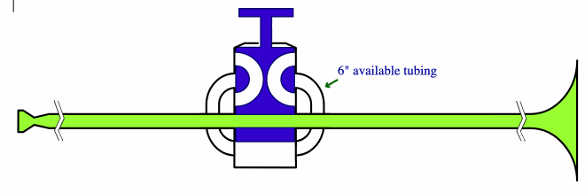

import Button from '@material-ui/core/Button';
import Spiral from '../components/common/Spiral.tsx';
import { State } from 'react-powerplug';
import { Note } from '@tonaljs/tonal';
import { InlineMath } from 'react-katex';
import 'katex/dist/katex.min.css';
import trumpet from '../assets/trumpet.svg';
import {
  angle,
  frequencyColor,
  nearestPitch,
  edo12
} from '../components/tuning/tuning.ts';
import * as Tone from 'tone';
import canUseDOM from '../components/canUseDOM.ts';
const { PolySynth, Synth } = Tone;
const harp =
  canUseDOM() &&
  new PolySynth(6, Synth, {
    volume: -16,
    envelope: { attack: 0.01, decay: 2, sustain: 0, release: 0.1 },
    oscillator: { type: 'fmtriangle' }
  }).toMaster();

The harmonic spiral from last post can also be used to vizualize the harmonics of instruments that work with overblowing, like a trumpet:

Before I show the spiral, let's look at how a trumpet handles pitch.

### How a trumpet produces different pitches

A trumpet without valves can just play the harmonic series, which has large gaps. To fix that, valves are used to send the air through extra detours:

_screenshot from [this animation](http://www.dwerden.com/comp/aCompIntro9_FlowFlow_F4.html)_

- the tube length directly affects the pitch of the horn => longer tube = lower note
- if no valve is pressed, the tube is the shortest
- if a valve is pressed, the tube is elongated by the length of the slide that comes out of its piston
- the elongation of the third slide is the same as the elongation of the first and second combined (approximately)
- the player can play all harmonics of a certain tube length by raising the air pressure
- with all harmonics of all possible tube lengths, all common equal temperament notes (or at least close ones) can be played (and more)

As there are 3 valves with two states each, we can create 8 different combinations. Each combination can be expressed as a binary number (0 = not pressed, 1 = pressed).
To read the binary numbers in a useful order, let's flip the trumpet. _If we would read the bits in the other direction, one two and three would not coincide with the valves one two and three_

### Valve Combinations

<table>
  <tbody>
    <tr>
      <th>color</th>
      <th>binary</th>
      <th>decimal</th>
      <th>semitones</th>
      <th>root</th>
    </tr>
    {[
      [0, '000', 'C2'],
      [-1, '010', 'B1'],
      [-2, '001', 'Bb1'],
      [-3, '011', 'A1'],
      [-3, '100', 'A1'],
      [-4, '110', 'Ab1'],
      [-5, '101', 'G1'],
      [-6, '111', 'Gb1']
    ].map(([offset, combination, root], i) => (
      <tr key={i}>
        <td>
          

        </td>
        <td>{combination}</td>
        <td>{parseInt(combination, 2)}</td>
        <td>{offset}</td>
        <td>{root}</td>
      </tr>
    ))}
  </tbody>
</table>

Due to the fact that the elongation of the third slide is the same as the elongation of the first and second slides combined, the combination 011 (3) creates the same harmonics as 100 (4). This lucky coincidence maps the decimal number 3 to the 3rd valve!

### Harmonic Spiral

<State
  initial={{
    zoom: 1.1,
    spin: 0,
    precision: 1,
    min: 0,
    max: 4,
    strokeWidth: 2,
    base: Note.freq('Bb1'),
    fontSize: 12,
    reduce: false,
    temper: false,
    defaultsOnly: false,
    showValves: false
  }}
>
  {({ state, setState }) => {
    const generator = 4 / 3;
    const notes = 54;
    const octaveRadius = 60;
    let ratios = [1, 2, 3, 4, 5];
    const valves = [
      [0, '000'],
      [-1, '010'],
      [-2, '001'],
      [-3, '011'],
      [-4, '110'],
      [-5, '101'],
      [-6, '111'],
      [-3, '100']
    ];
    const defaultPitches = [
      [2, -6],
      [2, -5],
      [2, -4],
      [2, -3],
      [2, -2],
      [2, -1],
      [2, 0],
      [3, -6],
      [3, -5],
      [3, -4],
      [3, -3],
      [3, -2],
      [3, -1],
      [3, 0],
      [4, -4],
      [4, -3],
      [4, -2],
      [4, -1],
      [4, 0],
      [5, -3],
      [5, -2],
      [5, -1],
      [5, 0],
      [6, -2],
      [6, -1],
      [6, 0],
      [8, -4],
      [8, -3],
      [8, -2],
      [8, -1],
      [8, 0],
      [10, -3],
      [10, -2]
    ];
    const allPitches = [
      [2, -6],
      [2, -5],
      [2, -4],
      [2, -3],
      [2, -2],
      [2, -1],
      [2, 0],
      [3, -6],
      [3, -5],
      [3, -4],
      [3, -3],
      [3, -2],
      [3, -1],
      [4, -6],
      [3, 0],
      [4, -5],
      [4, -4],
      [4, -3],
      [5, -5],
      [4, -1],
      [4, -2],
      [5, -4],
      [4, 0],
      [5, -3],
      [5, -2],
      [6, -5],
      [5, -1],
      [6, -4],
      [5, 0],
      [6, -3],
      [7, -5],
      [6, -2],
      [6, -1],
      [7, -4],
      [7, -3],
      [6, 0],
      [8, -5],
      [7, -2],
      [8, -4],
      [7, -1],
      [9, -5],
      [8, -3],
      [7, 0],
      [9, -4],
      [8, -2],
      [10, -5],
      [8, -1],
      [9, -3],
      [10, -4],
      [9, -2],
      [8, 0],
      [11, -5],
      [10, -3],
      [9, -1],
      [10, -2]
    ];
    const pitches = (state.defaultsOnly ? defaultPitches : allPitches).map(
      ([harmonic, offset]) => {
        const valve = edo12(offset);
        const transposed = edo12(offset + 2);
        const angle = harmonic * valve;
        return [
          angle,
          state.showValves
            ? parseInt(valves[Math.abs(offset)][1], 2)
            : nearestPitch(transposed * harmonic * state.base),
          frequencyColor(valve * state.base * 3)
        ];
      }
    );
    const show12EDO = true;
    return (
      <>
        

          <Spiral
            width={600}
            height={600}
            stroke="gray"
            {...state}
            getRadius={(angle, maxRadius, zoom) => zoom * angle * octaveRadius}
            lines={[].concat(
              show12EDO
                ? Array.from({ length: 12 }, (_, i) => [
                    0,
                    angle(Math.pow(2, i / 12) * Math.pow(2, state.max)),
                    'gray'
                  ])
                : []
            )}
            labels={pitches.map(([ratio, label, color], i) => ({
              label,
              angle: angle(ratio * 2),
              fill: color || frequencyColor(ratio * state.base),
              color: 'black'
            }))}
            onTrigger={(i) =>
              harp.triggerAttackRelease(pitches[i][0] * state.base, 1)
            }
          />
        

        <label>
          <input
            type="checkbox"
            checked={state.defaultsOnly}
            onChange={(e) => setState({ defaultsOnly: e.target.checked })}
          />
          Defaults Only
        </label>
         
        <label>
          <input
            type="checkbox"
            checked={state.showValves}
            onChange={(e) => setState({ showValves: e.target.checked })}
          />
          Show Combinations
        </label>
      </>
    );
  }}
</State>

- as the harmonic series gets denser as we go up, more and more combinations will end up on similar notes in higher registers.
- most of those pitches will by slightly detuned to each other, depending on the tube length and harmonic
- all the harmonic series start on their second partial (omitting the root partial), as by instrument design, the root partials are not intended to be played and hard to produce, so I omitted them.
- i have no idea how the exact length ratios of the slides are, I just assumed the roots were tuned to equal temperament. Nevertheless the pattern would look the same, just slightly detuned.

### Default Combinations

In practice, there are certain default combinations, so for simplicity each note is mostly played with the same combination.
It is desired that

- the pitch is close to equal temperament, relative to the root note of the horn
- lower harmonics are used in favor of higher harmonics

## Further Ideas

- Measure pitches of actual trumpet to find out where the "anchors" are
- Measure lengths of tube + slides of actual trumpet
- Write algorithm that outputs different default combinations for alternative tunings

## Links

- [Valve Systems](http://www.dwerden.com/eu-articles-comp.cfm) + [animated version](http://www.dwerden.com/comp/aCompIntro9_FlowFlow_F4.html)
- [Trumpet Tuning Tendencies Relating to the Overtone Series with Solutions](https://www.utc.edu/faculty/erika-schafer/musiceducatorresources/tuning.php)
- [Trumpet on music.stackexchange](https://music.stackexchange.com/questions/84172/trumpet-valves-lengths-and-pitch)
